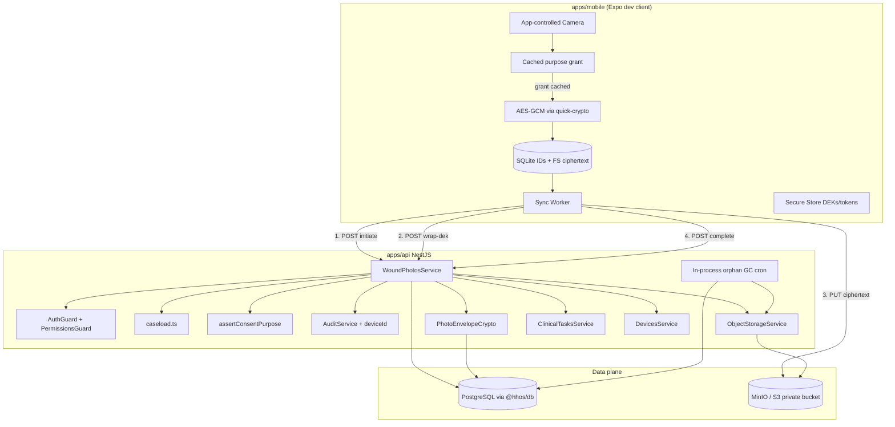
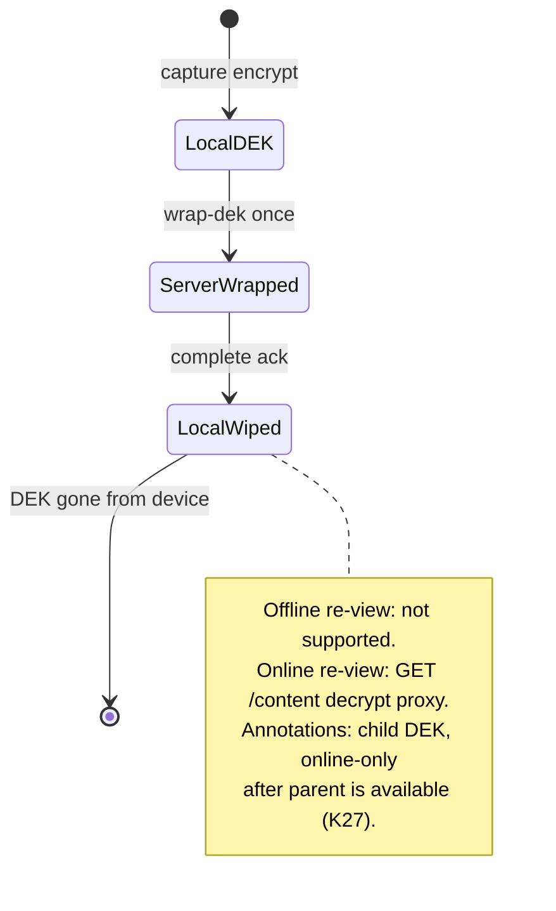
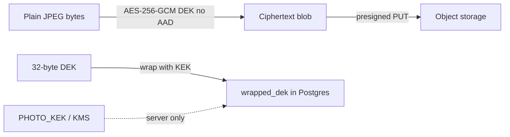
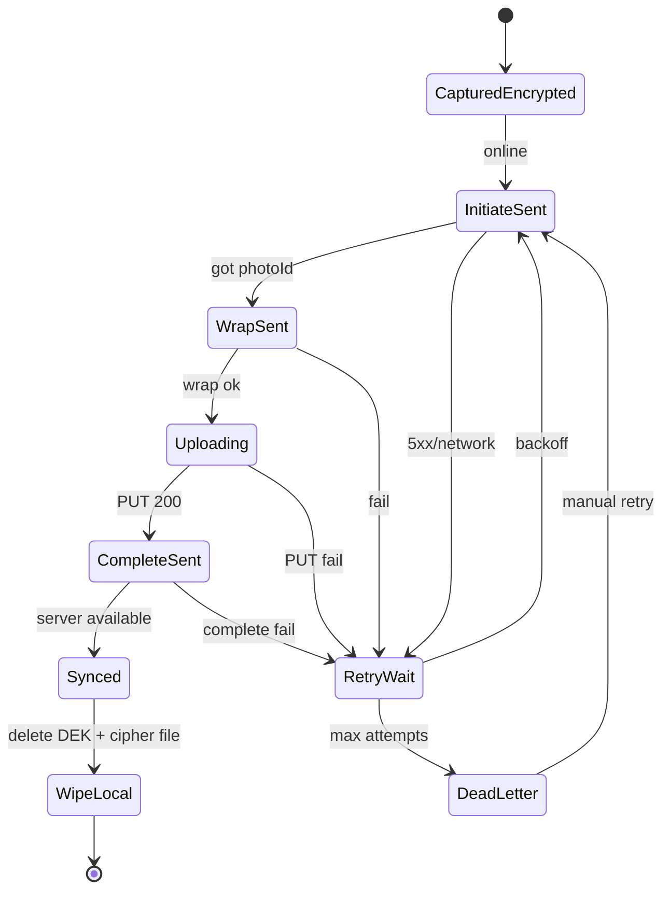
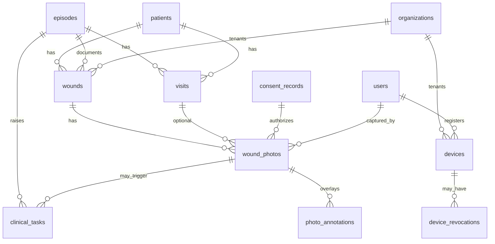
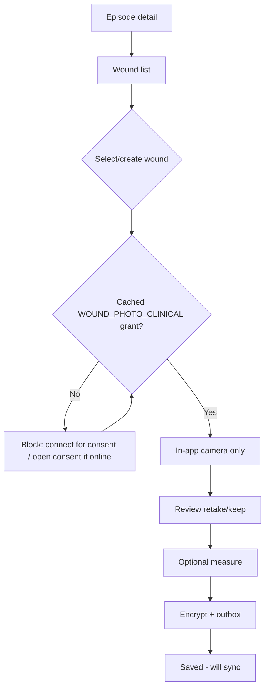
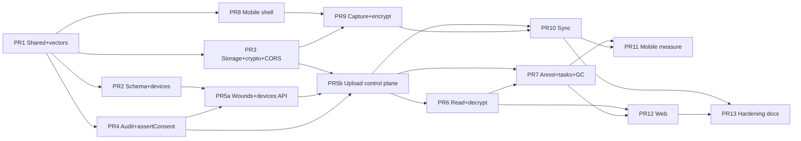

# HHOS Phase 2 — Secure Wound Photography & Offline Field Documentation

| Field | Value |
|-------|--------|
| **Status** | Approved for implementation (rev 5 — open questions locked) |
| **Phase** | 2 (builds on Phase 0 bootstrap + Phase 1 intake/consents/RBAC/audit) |
| **Authors** | Systems architecture (agent-assisted design) |
| **Date** | 2026-07-18 |
| **Repo root** | `/Users/kyhumble/hhos` |
| **Related** | `AGENTS.md`, `docs/architecture/overview.md`, `docs/architecture/phase-2-kpis.md`, `docs/domain/consent-purposes.md`, `docs/compliance/threat-model-v0.md` |

---

## Overview

Phase 2 delivers **mobile-first, consent-gated, offline-capable wound photography** for field RNs. Clinical images are captured **only via an app-controlled camera**, encrypted on-device before leaving the device, uploaded through an **idempotent outbox + presigned object-storage path**, stored as **private encrypted objects** (MinIO local / S3+KMS prod), and cataloged in Postgres with **immutable-style audit** of upload and view events.

This design deliberately **extends Phase 1** rather than inventing parallel stacks:

| Existing building block | Path | Phase 2 reuse |
|-------------------------|------|----------------|
| Consent purpose check | `ConsentsService.activePurposes` (`apps/api/src/consents/consents.service.ts`) | New `assertConsentPurpose`; gate capture/view with `WOUND_PHOTO_CLINICAL` |
| Photo consent checklist | `ChecklistService` `PHOTO_CONSENT` ↔ `WOUND_PHOTO` | Operational gate: consent before field photo work |
| Field encryption pattern | `apps/api/src/common/field-crypto.ts` (AES-256-GCM) | Same framing `iv\|\|tag\|\|ciphertext`; new envelope service + shared test vectors |
| Caseload scope | `apps/api/src/common/caseload.ts` | All photo endpoints caseload-scoped for `field_rn` |
| Audit | `AuditService.writeFromUser` | Extend with `deviceId`; `wound_photo.*` + break-glass view |
| Document meta stub | `clinical_documents_meta` + `DocumentsController` stub | **Leave isolated**; photos never served via `document:read` |
| Idempotency | Consent/referral `Idempotency-Key` header pattern | Photo initiate + complete + annotations |
| Org settings | `organizations.settings.photoGeotagEnabled` | Default `false`; AND with env explicit opt-in (`true`/`1`) |
| Env flags | `.env.example` `PHOTO_GEOTAG_ENABLED`, MinIO/S3 vars | + `PHOTO_KEK`, `FEATURE_WOUND_PHOTOS`, public storage URL |
| Mobile shell | `apps/mobile` Expo Router placeholder | **Dev client / prebuild** for crypto; camera + outbox |

**Clinical source of truth rule (non-negotiable):** gallery / camera-roll import is **not** a clinical capture path. Annotations are non-destructive side-cars over originals, each with its **own DEK**.

---

## Background & Motivation

### Why now

Phase 1 ships intake, versioned consents (including `WOUND_PHOTO` with purposes `WOUND_PHOTO_CLINICAL` / `WOUND_PHOTO_QA`), SOC tracking, RBAC, field-RN caseload, and append-only audit. Wound agencies cannot complete field documentation without **timestamped, consent-linked clinical photos**. Deferring photos forces paper/photo-app workarounds that are HIPAA-hostile.

### Problem statement

Field RNs work in homes with intermittent connectivity. They need to:

1. Prove consent before shutter (`WOUND_PHOTO_CLINICAL`).
2. Capture with metadata (who/when/where-policy/device/wound/visit).
3. Keep working offline without data loss.
4. Never leave plaintext PHI photos in cloud transit or device caches.
5. Give clinical leads visibility when wounds exceed size thresholds.

### Constraints already encoded in the codebase

- `AGENTS.md`: consent before photo; no gallery clinical source of truth; no PHI in logs; HITL AI later.
- `docs/domain/consent-purposes.md`: Phase 2 capture requires active `WOUND_PHOTO_CLINICAL`.
- `organizations.settings.photoGeotagEnabled` defaults **false**; env `PHOTO_GEOTAG_ENABLED=false`.
- Legal consent body remains **NOT LEGAL FINAL** until counsel review.
- `clinical_documents_meta` exists but is generic; documents API is a stub — **must not** become a photo content path.
- Local MinIO bucket `hhos-documents` is private (`mc anonymous set none`); CORS not yet configured (see Storage networking).
- Billing role today has `DOCUMENT_READ` (`packages/shared/src/permissions.ts`) — photo content must **never** accept that permission.
- `audit_events.device_id` column exists; `AuditService.write` does **not** populate it yet (must extend).
- Mobile is Expo 52 managed shell (`apps/mobile/package.json`) — no camera/crypto native modules yet.

---

## Goals & Non-Goals

### Goals

1. **App-controlled camera only** for clinical wound photos; no gallery pick for clinical records.
2. **Rich structured metadata**: capture timestamp, optional geotag (policy-gated, default off), nurse ID, patient/episode/wound/visit linkage, device details, content hashes.
3. **Consent linkage**: every clinical photo stores `consent_record_id` verified by `assertConsentPurpose` at initiate, complete, and view.
4. **Client-side encrypt-before-upload** using AES-256-GCM + envelope encryption (DEK per object including annotations).
5. **Offline photo outbox** with retry/backoff, durable local queue, idempotent server complete.
6. **Private object storage**, short-lived presigned PUT, decrypt-proxy view only.
7. **Relational catalog** consent-linked; soft-deletable; originals immutable after finalize.
8. **Optional non-destructive annotations** as separate encrypted objects (child DEKs).
9. **Large-wound threshold hooks** → clinical lead task.
10. **KPI hooks** without PHI in logs.
11. **Extend** Phase 1 RBAC, caseload, audit, checklist — do not fork.

### MVP operational assumptions (locked)

| Assumption | Detail |
|------------|--------|
| **Consent before field photo work** | MVP requires `WOUND_PHOTO` / `PHOTO_CONSENT` captured **online at intake or SOC** while connectivity exists. Field capture may proceed **offline only if** the device already has a cached grant (`consentRecordId` + purpose) from a successful online `active-purposes` (or consent capture) fetch. |
| **No offline consent capture in MVP** | Offline consent outbox is **Phase 2.1**. If no cached grant, camera is blocked with “Connect to capture photo consent” — not a gallery workaround. |
| **Offline re-view of photos** | After successful sync, local DEK and ciphertext are wiped. Re-view requires network + `GET /content` decrypt proxy. |
| **Single-tenant KEK MVP** | One process-level `PHOTO_KEK` / one KMS CMK for the deployment; `kek_key_id` stored per row (`local/v1` or KMS key id). Multi-org CMK isolation is Phase 2.1+. |

### Non-Goals (explicit)

| Out of scope | Phase |
|--------------|-------|
| Full OASIS-E2 assessments | 3 |
| AI routing / scheduling | 4 |
| Billing / claims | 5 |
| Peptide / longevity modules | 7 |
| Production Cognito auth cutover | Follow-on; local JWT remains Phase 2 MVP default |
| Gallery import as clinical truth | Never |
| Auto-finalize AI wound measurements | Never (HITL later) |
| Patient / family portal photo view | Later |
| Full offline visit charting beyond photo + minimal wound notes | Later |
| Offline consent capture outbox | Phase 2.1 |
| SQLCipher / zero-knowledge server | Not MVP (see decisions) |
| `clinical_documents_meta` bridge for photos | Deferred past photo MVP (PR 12+) |
| Timeline events for photo/task | Deferred to PR 7 optional / later |

---

## Proposed Design

### High-level architecture



**Note:** Redis is **not** part of Phase 2 photo MVP. Orphan GC and metrics use an **in-process Nest scheduled job** (or `setInterval` bootstrap hook). Redis remains available in docker-compose for later phases.

### Capture → sync sequence

```mermaid
sequenceDiagram
  participant RN as Field RN App
  participant Local as Outbox + SecureStore
  participant API as NestJS API
  participant Cons as assertConsentPurpose
  participant S3 as MinIO/S3
  participant DB as Postgres
  participant Aud as AuditService

  Note over RN: Online at intake/SOC: cache WOUND_PHOTO_CLINICAL grant

  RN->>RN: Open camera only if cached grant present
  RN->>Local: DEK; AES-GCM encrypt image (no AAD)
  RN->>Local: Enqueue outbox (cipher file path, meta, DEK in SecureStore)
  RN-->>RN: Saved offline · pending sync

  Note over RN,S3: When online

  RN->>API: POST /v1/wound-photos/uploads (Idempotency-Key=clientPhotoId)
  API->>Cons: assertConsentPurpose(consentRecordId, patient, CLINICAL)
  API->>API: assert device active+registered (not missing/revoked)
  API->>DB: insert wound_photos status=pending_upload
  API->>Aud: wound_photo.initiate (deviceId)
  API-->>RN: photoId, presignedPutUrl (signed for S3_PUBLIC_ENDPOINT), expiresAt

  RN->>API: POST /v1/wound-photos/:id/wrap-dek {dekBase64} once
  API->>DB: wrapped_dek; status=pending_put
  API->>Aud: wound_photo.dek_wrapped
  API-->>RN: ok

  RN->>S3: PUT ciphertext (presigned)
  RN->>API: POST /v1/wound-photos/:id/complete {cipherSha256, byteSize, ...}
  API->>Cons: re-assert consent still active
  API->>S3: GET object stream; SHA-256 verify equals cipherSha256
  API->>DB: status=available
  API->>Aud: wound_photo.upload_complete
  API-->>RN: {status: available}
  RN->>Local: Wipe local DEK + ciphertext; mark synced
```

### Domain model concepts

| Concept | Description |
|---------|-------------|
| **Wound** | Clinical site on a patient within an episode. |
| **Visit** | Minimal encounter container; optional on photos. |
| **Wound photo** | One clinical image + metadata + encryption envelope + consent link. |
| **Annotation side-car** | Overlay/vector with **its own DEK**; never replaces original. |
| **Measurement** | length/width/depth cm; settable on complete and correctable via PATCH. |
| **Outbox item** | Device-local durable unit until server `available`. |
| **Device** | Registered app install; revocable blacklist. |
| **Clinical task** | Work item for clinical lead (large wound review). |

### Component layout (new code)

```
packages/shared/src/
  wound-photo.ts              # Zod schemas, enums
  photo-crypto-vectors.ts     # framing test vectors (JSON fixtures)
  permissions.ts              # wound_photo:*, clinical_task:*
packages/db/src/schema/
  wounds.ts                   # wounds, visits, wound_photos, photo_annotations, clinical_tasks
  devices.ts                  # devices, device_revocations
  index.ts
apps/api/src/
  wound-photos/
  storage/
  photo-crypto/
  clinical-tasks/
  devices/
  common/features.ts          # FEATURE_* boolean parser
  common/redact.ts            # + dek/geo keys
  audit/audit.service.ts      # + deviceId
  consents/                   # assertConsentPurpose
apps/mobile/                  # Expo prebuild / dev client
  src/camera/
  src/crypto/                 # react-native-quick-crypto AES-GCM
  src/outbox/                 # expo-sqlite + FS cipher files
  src/secure/
  src/api/
```

### Permissions (hard rules)

New codes (PR 1). **Content routes check only these — never `document:read`.**

| Permission | field_rn | clinical_lead | intake | compliance | billing | admin |
|------------|----------|---------------|--------|------------|---------|-------|
| `wound_photo:capture` | ✓ | ✓ | — | — | — | ✓ |
| `wound_photo:read` | ✓ | ✓ | — | ✓ | **—** | ✓ |
| `wound_photo:delete` | — | ✓ | — | ✓ | — | ✓ |
| `clinical_task:read` | — | ✓ | — | ✓ | — | ✓ |
| `clinical_task:write` | — | ✓ | — | — | — | ✓ |
| `device:register` | ✓ (self) | ✓ | ✓ | ✓ | ✓ | ✓ |
| `device:revoke` | — | — | — | ✓ | — | ✓ |

**Hard rule:** `GET /v1/wound-photos/:id/content` requires `wound_photo:read` only. Billing’s existing `DOCUMENT_READ` does **not** grant photo access. `DocumentsController` stays a non-photo stub; do not list photo bytes under documents until a separate design.

`PermissionsGuard` today deny-fails only when `@RequirePermissions` is set (`apps/api/src/common/permissions.guard.ts`). Every photo route **must** annotate permissions (no unannotated PHI routes).

---

## Encryption Design

### Principles

1. Encrypt at rest on device before outbox enqueue completes.
2. Never upload plaintext image bytes to API or S3.
3. Envelope: per-object DEK (AES-256-GCM), DEK wrapped by org/server KEK.
4. **No AAD in MVP** (locked — see Key Decision K17). Framing is `iv (12) || tag (16) || ciphertext` only, matching `field-crypto.ts`.
5. Separate `PHOTO_KEK` from `FIELD_ENCRYPTION_KEY`.

### Mobile crypto stack (locked)

| Concern | MVP choice |
|---------|------------|
| AES-256-GCM | **`react-native-quick-crypto`** (Node crypto API compatible) |
| Random / hashing | `expo-crypto` for digests if needed; DEK via quick-crypto `randomBytes` |
| Workflow | **Expo prebuild / dev client** (not pure managed Expo Go) — required for native crypto |
| Framing | Shared vectors in `packages/shared` / `packages/photo-crypto-vectors` consumed by API unit tests **and** mobile tests |
| Performance | Cap plaintext ≤ 12 MB after JPEG normalize (max edge 2048, quality ~0.8) |

Do **not** claim `expo-crypto` performs AES-GCM — it does not.

### DEK lifecycle (locked — resolves annotation + offline re-view)



| Phase | Parent photo DEK | Annotation DEK |
|-------|------------------|----------------|
| After capture, pre-sync | Secure Store key `hhos.photo-dek.{clientPhotoId}`; used only for that photo’s ciphertext | N/A (annotations online-only — see below) |
| After `wrap-dek` | Still local until complete; server has `wrapped_dek` | — |
| After `available` ack | **Delete** Secure Store key + local ciphertext file | — |
| Offline re-view of synced photo | **Not supported in MVP** | N/A |
| Online re-view | Server unwraps parent DEK in memory; stream decrypt | Server unwraps annotation DEK independently |
| New annotation | **Requires connectivity** (no annotation outbox in MVP) | Client generates **new child DEK**; online initiate → wrap → PUT → complete; Secure Store `hhos.annot-dek.{clientAnnotationId}` until wipe |

**Annotation model (MVP):**

1. Always **child DEK per annotation object** (option B). “Same DEK as parent” is **rejected**.
2. **Online-only:** no `annotation_outbox`; annotate UI blocked when offline or parent not `available`. Defer offline annotation queue to Phase 2.1.
3. Viewer combines original + overlay after separate decrypts (or server composes later — non-MVP).

### Two-layer envelope



#### Server wrap rules (locked)

| Rule | Detail |
|------|--------|
| When | After initiate; photo status must be `pending_upload` |
| After success | Status → `pending_put`; `wrapped_dek` set; `kek_key_id` set |
| Single-use | Second `wrap-dek` → `409 DEK_ALREADY_WRAPPED` |
| Complete requires | Status `pending_put`, `wrapped_dek` present, object hash match |
| Body logging | Wrap route must not log body; Nest logger redaction + no raw body middleware dumps |
| Rate limit | Per-user e.g. 30 wrap/min (simple in-memory or token bucket in service) |
| Memory | Zeroize DEK buffer after wrap; never write DEK to disk |

#### Status machine (server)

```
pending_upload → (wrap-dek) → pending_put → (complete ok) → available
                                              ↘ (hash fail) stay pending_put / failed
available → (soft_delete) → soft_deleted
pending_* → (orphan GC > TTL) → abandoned
```

#### View / decrypt path (canonical)

**Canonical endpoint only:** `GET /v1/wound-photos/:id/content`  
There is **no** `view-url` endpoint in MVP (diagrams must not invent one).

```mermaid
sequenceDiagram
  participant Client as Web/Mobile viewer
  participant API as WoundPhotosService
  participant Cons as assertConsentPurpose / break-glass
  participant S3 as Object storage
  participant KEK as PHOTO_KEK/KMS

  Client->>API: GET /v1/wound-photos/:id/content
  API->>API: wound_photo:read + caseload
  alt Normal clinical view field_rn or clinical_lead
    API->>Cons: assertConsentPurpose WOUND_PHOTO_CLINICAL only
    Note over Cons: QA purpose not used on default path K28
  else Compliance break-glass
    API->>API: require BREAK_GLASS_PHI + reason header/body
    API->>API: skip purpose assert; actorType break_glass
  end
  API->>KEK: unwrap DEK
  API->>S3: get ciphertext stream via internalClient
  API->>API: decrypt streaming; Cache-Control: private, no-store
  API-->>Client: image/jpeg body
  API->>API: audit wound_photo.view or view_break_glass
```

**Gallery / thumbnail MVP policy:** List endpoints return **metadata only** (no image bytes). Web episode UI shows placeholders / measurement badges; full image loads **on demand** when user opens a photo (single `GET /content`). No thumbnail side-object in MVP.

| Control | Value |
|---------|-------|
| Max concurrent decrypts per API instance | 4 (queue or 503 `DECRYPT_BUSY`) |
| Max image size | 15 MB ciphertext |
| Response headers | `Cache-Control: private, no-store`, no CDN cache |
| Streaming | Yes — do not buffer full plaintext when avoidable |
| Logging | Log `photoId`, `requestId`, status — never purpose query string at reverse-proxy info dumps if possible; never geo |

#### Thumbnail (Phase 2.1, not MVP)

Optional encrypted thumbnail object generated at complete with child DEK; list could return `hasThumbnail`. Out of MVP scope.

### Key hierarchy and rotation (locked MVP)

| Key | Scope | Storage |
|-----|-------|---------|
| Device auth token | Session | expo-secure-store |
| Photo/annotation DEK | Single object | Wrapped in DB; transient on device until wipe |
| PHOTO_KEK | **Deployment-wide MVP** | Env `PHOTO_KEK` local; AWS KMS CMK prod |
| `kek_key_id` | Per photo row | Constant `local/v1` in dev; KMS key id/ARN version in prod |
| FIELD_ENCRYPTION_KEY | SSN/member id | Existing; **do not reuse** |

**Rotation policy:**

1. Never discard old KEK while rows reference it.
2. Rotation = introduce new KEK id → background job unwrap-with-old / wrap-with-new → update `wrapped_dek` + `kek_key_id`.
3. Lost-device playbook **does not** rotate PHOTO_KEK unless DEKs themselves were exfiltrated (high bar); prefer user disable + device revoke.
4. Multi-org per-CMK isolation is **Phase 2.1+** (document assumption: single org / single KEK in Phase 2 MVP matching current single-org seeds).

---

## Offline Sync Protocol

### Local persistence (locked MVP)

| Option | Verdict |
|--------|---------|
| SQLCipher / op-sqlite encrypted | **Not MVP** — requires heavier native story; revisit Phase 2.1 |
| **expo-sqlite (plaintext) + FS ciphertext + Secure Store secrets** | **MVP** |
| AsyncStorage for binaries | **Banned** |

**MVP layout:**

| Data | Where |
|------|-------|
| Outbox rows (IDs, statuses, paths, hashes, error codes) | `expo-sqlite` — **no patient names, no geo, no DEKs** |
| Ciphertext files | App sandbox FS via `expo-file-system` (mode private) |
| DEKs (pre-sync only), JWT, deviceId | `expo-secure-store` (key layout below) |
| Cached consent grants | Secure Store or sqlite: `{ patientId, consentRecordId, purpose, fetchedAt, expiresAt? }` — IDs only |

**Secure Store key layout (locked):**

| Key pattern | Value | Wipe when |
|-------------|-------|-----------|
| `hhos.deviceId` | App-generated UUID | Never (unless factory reset / revoke local wipe) |
| `hhos.accessToken` | JWT | Logout / expiry refresh |
| `hhos.photo-dek.{clientPhotoId}` | Base64 DEK for one pending photo | Complete ack, abandon, device revoke wipe, dead-letter purge |
| `hhos.annot-dek.{clientAnnotationId}` | Base64 DEK for one in-flight annotation | Annotation complete ack / abandon / revoke wipe |
| `hhos.consent-grant.{patientId}` | JSON grant cache (ids only) | Logout, revoke known, TTL expiry |

Never store DEKs under a single shared key. On wipe, delete the specific key; optional sweep of keys with prefix `hhos.photo-dek.` / `hhos.annot-dek.` on revoke.

**Device local schema (conceptual):**

```sql
CREATE TABLE photo_outbox (
  client_photo_id TEXT PRIMARY KEY,
  patient_id TEXT NOT NULL,
  episode_id TEXT NOT NULL,
  wound_id TEXT,
  visit_id TEXT,
  consent_record_id TEXT NOT NULL,
  local_cipher_path TEXT NOT NULL,
  plaintext_sha256 TEXT NOT NULL,
  cipher_sha256 TEXT NOT NULL,
  byte_size INTEGER NOT NULL,
  meta_json TEXT NOT NULL,  -- structured codes only
  status TEXT NOT NULL,     -- pending_wrap|pending_upload|uploading|pending_complete|synced|failed|dead
  attempt_count INTEGER NOT NULL DEFAULT 0,
  next_attempt_at INTEGER,
  last_error_code TEXT,
  server_photo_id TEXT,
  created_at INTEGER NOT NULL,
  updated_at INTEGER NOT NULL
);
```

**Platform implication:** Phase 2 mobile uses **EAS dev client / `npx expo prebuild`** for `react-native-quick-crypto` (+ camera). Document in `apps/mobile` README: Expo Go is **unsupported** for photo capture builds.

### Sync state machine (client)



### Idempotency

| Operation | Key | Server behavior |
|-----------|-----|-----------------|
| Initiate | `Idempotency-Key: {clientPhotoId}` | Unique `(org_id, client_photo_id)`; replay returns existing + **fresh presign** if still pending |
| Wrap | once per photoId | 409 if already wrapped |
| Complete | `clientPhotoId` + `cipherSha256` | Replay 200 if available + same hash; **409** hash mismatch |
| Annotation | `clientAnnotationId` | Same pattern |

### Retry / backoff

- Exponential: `min(15m, 2^attempt * 5s) + jitter`.
- Max attempts: 20 or 72h wall clock → dead-letter.
- No retry: 401, 403, 409 (except refresh presign on initiate replay).
- Retry: network, 408, 429, 5xx.

### Conflict / consent mid-sync

| Case | Resolution |
|------|------------|
| Double complete same client id + hash | Idempotent success |
| Complete after soft-delete | 410; abandon local |
| Consent revoked after capture, before complete | `403 CONSENT_REVOKED` / `CONSENT_REQUIRED`; freeze outbox; prompt online re-consent or abandon (audit) |
| Caseload removed | `403 CASELOAD_LOST` |
| Device never registered | `403 DEVICE_NOT_REGISTERED`; register before sync |
| Device revoked | `403 DEVICE_REVOKED`; wipe local PHI on next open |

### Background sync triggers

1. Foreground + connectivity (primary reliability path).
2. NetInfo online event.
3. Periodic while active (~30s).
4. Optional TaskManager — best-effort only.

### Device wipe / loss

| Control | Detail |
|---------|--------|
| OS encryption | MDM policy (document) |
| Token lifetime | Existing JWT ~8h |
| Register | `POST /v1/devices/register` stores platform, app version |
| Register | Must succeed **before** sync worker starts / first upload (PR 10) |
| Active device required | initiate/wrap/complete require row with `status=active` for `(org_id, device_id)` |
| Missing device | `403 DEVICE_NOT_REGISTERED` |
| Revoke | `POST /v1/devices/:id/revoke` → `status=revoked`; subsequent ops `403 DEVICE_REVOKED` |
| Local wipe | On revoke known at next API call / app open: purge outbox FS + all `hhos.photo-dek.*` / `hhos.annot-dek.*` keys |

---

## Data Model Changes

All schema in `@hhos/db` only. New migration after `0000_silly_harpoon.sql`.

### ERD



### Tables

#### `wounds`

| Column | Type | Notes |
|--------|------|-------|
| `id` | uuid PK | |
| `org_id` | uuid FK | |
| `patient_id` | uuid FK | |
| `episode_id` | uuid FK | |
| `label` | text | clinical location label |
| `body_site_code` | text nullable | |
| `laterality` | enum | `left\|right\|bilateral\|midline\|na` |
| `wound_type` | text nullable | controlled list in shared |
| `opened_at` | timestamptz | |
| `closed_at` | timestamptz nullable | |
| `status` | enum | `active\|healed\|transferred\|void` |
| `created_by` | uuid | |
| `created_at` / `updated_at` | timestamptz | |
| `deleted_at` | timestamptz | soft delete |

#### `visits` (minimal)

| Column | Type | Notes |
|--------|------|-------|
| `id` | uuid PK | |
| `org_id` | uuid FK | |
| `patient_id` / `episode_id` | uuid FK | |
| `clinician_user_id` | uuid FK | |
| `started_at` / `ended_at` | timestamptz | |
| `visit_type` | enum | `soc\|routine\|prn\|other` |
| `status` | enum | `in_progress\|completed\|cancelled` |
| `client_visit_id` | text nullable | unique with org when set |
| `created_at` / `deleted_at` | | |

#### `wound_photos`

| Column | Type | Notes |
|--------|------|-------|
| `id` | uuid PK | server id |
| `org_id`, `patient_id`, `episode_id`, `wound_id` | uuid FK | |
| `visit_id` | uuid FK nullable | |
| `consent_record_id` | uuid FK **required** | |
| `client_photo_id` | text not null | unique per org |
| `status` | enum | `pending_upload\|pending_put\|available\|failed\|abandoned\|soft_deleted` |
| `captured_at` | timestamptz | device clock |
| `captured_by_user_id` | uuid FK | |
| `device_id` | text FK-ish → devices.device_id | |
| `device_model` / `device_os` / `app_version` | text | |
| `geo_lat` / `geo_lng` / `geo_accuracy_m` | nullable | only if policy allows |
| `content_type` | text | `image/jpeg` |
| `byte_size` | integer | ciphertext size |
| `plaintext_sha256` / `cipher_sha256` | char(64) | |
| `storage_key` | text | opaque |
| `wrapped_dek` | bytea nullable | set after wrap |
| `kek_key_id` | text nullable | e.g. `local/v1` |
| `width_px` / `height_px` | integer nullable | |
| `capture_source` | enum | **`app_camera` only** |
| `purpose_at_capture` | purpose_code | `WOUND_PHOTO_CLINICAL` |
| `length_cm` / `width_cm` / `depth_cm` | numeric nullable | |
| `measurement_method` | enum nullable | |
| `is_large_wound` | boolean default false | |
| `uploaded_at` | timestamptz nullable | |
| `created_at` / `updated_at` / `deleted_at` | | |

**Not in MVP schema:** `document_meta_id` bridge (deferred).

#### `photo_annotations`

| Column | Type | Notes |
|--------|------|-------|
| `id` | uuid PK | |
| `org_id` | uuid FK | |
| `wound_photo_id` | uuid FK | parent must be `available` for post-sync; or allow pending for pre-sync MVP only if parent local — **server requires parent `available`** for simplicity |
| `client_annotation_id` | text | unique per org |
| `annotation_type` | enum | `vector_json\|overlay_png` (both stored as **encrypted object** only) |
| `status` | enum | same pending/available pattern |
| `storage_key` | text not null once available | ciphertext object key |
| `wrapped_dek` / `kek_key_id` | | **own DEK** |
| `cipher_sha256` / `byte_size` | | |
| `created_by` / `created_at` / `deleted_at` | | |

**No plaintext `payload_json` column in MVP.** Vector stroke JSON and overlay PNGs are always client-encrypted blobs in object storage (same envelope as photos). Optional non-PHI flags only (e.g. `stroke_count integer`) may be added later if needed — never free-text clinical notes on the annotation row.

#### `clinical_tasks`

| Column | Type | Notes |
|--------|------|-------|
| `id` | uuid PK | |
| `org_id`, `episode_id`, `patient_id` | uuid FK | |
| `wound_photo_id` | uuid nullable | |
| `task_type` | enum | `large_wound_review\|photo_qa\|other` |
| `status` | enum | `open\|in_progress\|done\|cancelled` |
| `priority` | enum | `routine\|urgent` |
| `title` / `details` | text | no patient name required |
| `assignee_user_id` | uuid nullable | |
| `created_by` / timestamps | | |

#### `devices` (PR 2 — required early)

| Column | Type | Notes |
|--------|------|-------|
| `id` | uuid PK | |
| `org_id` | uuid FK | |
| `user_id` | uuid FK | owner |
| `device_id` | text not null | app-generated UUID; unique per org |
| `platform` | text | `ios\|android` |
| `model` / `os_version` / `app_version` | text | |
| `status` | enum | `active\|revoked` |
| `last_seen_at` | timestamptz | updated on register upsert + successful photo ops |
| `created_at` | timestamptz | |

#### `device_revocations`

| Column | Type | Notes |
|--------|------|-------|
| `id` | uuid PK | |
| `device_row_id` | uuid FK | |
| `revoked_at` | timestamptz | |
| `revoked_by_user_id` | uuid | |
| `reason` | text | |

**Device gate on photo ops (locked):** initiate, wrap-dek, complete, abandon, annotation uploads:

1. Lookup `(org_id, device_id)` from request body/device field.
2. **Missing row** → `403 DEVICE_NOT_REGISTERED` (do not treat as allowed).
3. **`status = revoked`** → `403 DEVICE_REVOKED`.
4. **`status = active`** → allow; optionally touch `last_seen_at`.

`POST /v1/devices/register` is **upsert** on `(org_id, device_id)`: creates `active` or refreshes `last_seen_at` / app_version if already active; if revoked, return `403 DEVICE_REVOKED` (admin must un-revoke via separate path if ever needed — MVP: no self-unrevoke).

#### Org settings extension

```ts
{
  socDueHours?: number;
  photoGeotagEnabled?: boolean;      // default false
  coverageVerifiedRequired?: boolean;
  woundPathwayDefault?: boolean;
  largeWoundLengthCm?: number;       // default 10
  largeWoundWidthCm?: number;        // default 10
  largeWoundAreaCm2?: number;        // default 50
  photoMaxBytes?: number;            // default 12_000_000
  photoPendingTtlHours?: number;     // default 24 — orphan GC
}
```

#### Deferred (not PR 2)

- `clinical_documents_meta` link from wound photos  
- `timeline_event_type` extensions (`photo_uploaded`, `task_created`) — optional PR 7+

---

## API / Interface Changes

Base `/v1`. Auth + permissions + Zod. Errors: `ApiErrorSchema`.

### Consent assertion contract (new)

Extract on `ConsentsService` (or small helper used by photo module):

```ts
async assertConsentPurpose(
  user: AuthUser,
  args: {
    patientId: string;
    consentRecordId: string;
    purpose: PurposeCode; // WOUND_PHOTO_CLINICAL | WOUND_PHOTO_QA
    episodeId?: string;   // if provided, record.episodeId must be null or equal
  },
): Promise<{ consentRecordId: string; templateId: string }>
```

**Check order (locked — implement exactly):**

1. Caseload / patient access for user (else `FORBIDDEN` / caseload message).
2. Load consent by `id` + `org_id = user.orgId`. Missing → `404 NOT_FOUND` (no cross-org leak).
3. If `status === 'revoked'` → `403 CONSENT_REVOKED` (**before** generic not-signed handling).
4. If `status !== 'signed'` (draft/void/other) → `403 CONSENT_REQUIRED`.
5. If `expires_at` is set and `expires_at <= now` → `403 CONSENT_EXPIRED`.
6. If `patient_id !== args.patientId` → `403 CONSENT_MISMATCH`.
7. Optional episode: if `args.episodeId` set and `consent.episodeId` set and they differ → `403 CONSENT_MISMATCH`.
8. Join template purposes for **that** `template_id`; if requested purpose missing → `403 CONSENT_REQUIRED`.
9. Success → return `{ consentRecordId, templateId }`.

**Error codes:**

| Code | HTTP | When |
|------|------|------|
| `CONSENT_REQUIRED` | 403 | Not signed (non-revoked), or purpose missing on template |
| `CONSENT_MISMATCH` | 403 | Wrong patient/episode |
| `CONSENT_REVOKED` | 403 | Status revoked |
| `CONSENT_EXPIRED` | 403 | Past expires_at while still signed |
| `NOT_FOUND` | 404 | Unknown consent id in org |

Call on: **initiate**, **complete**, **content view** (normal clinical path), annotation initiate.

`activePurposes` remains for mobile grant discovery; **server never trusts purpose without re-asserting the specific `consentRecordId`.**

### View purpose matrix (locked — PR 6)

Capture always stores `purpose_at_capture = WOUND_PHOTO_CLINICAL`. View asserts purpose as follows:

| Caller | Path | Purpose assert |
|--------|------|----------------|
| `field_rn` | Normal `GET .../content` | `assertConsentPurpose(..., WOUND_PHOTO_CLINICAL)` using photo’s `consent_record_id` |
| `clinical_lead` | Normal view | Same — **`WOUND_PHOTO_CLINICAL`** |
| `clinical_lead` | Future QA review mode (not MVP UI) | May assert `WOUND_PHOTO_QA` when that purpose is granted; out of MVP scope |
| `compliance` | Normal path | **No** unrestricted normal view without purpose; use break-glass |
| `compliance` | Break-glass | Skip purpose assert; require `BREAK_GLASS_PHI` + reason; audit `view_break_glass` |
| `billing` / others | Any content | Denied by permission (`wound_photo:read` absent) |

Do **not** silently assert `WOUND_PHOTO_QA` for clinical_lead on the default viewer.

### Geotag policy resolution (locked — fail-closed)

```
// Env must be explicitly enabled. Unset / empty / "false" => env side false.
envGeoOn = process.env.PHOTO_GEOTAG_ENABLED === 'true'
         || process.env.PHOTO_GEOTAG_ENABLED === '1'
allowGeo = envGeoOn && (org.settings.photoGeotagEnabled === true)
```

- **Fail-closed:** missing env var ⇒ geo off even if org enables (AGENTS.md default off; avoids prod misconfig fail-open).
- Local `.env.example` keeps `PHOTO_GEOTAG_ENABLED=false`; set to `true` only when deliberately testing geotag **and** org setting true.
- If `!allowGeo` and client sends `geo`: **strip silently** (do not 400) and store null.
- If `allowGeo`: persist geo; **read path** returns geo only to clinical/compliance/admin with `wound_photo:read` — never billing.

### Soft-delete rules (locked)

| Actor | Action |
|-------|--------|
| field_rn | May **abandon local outbox** pre-complete (no server row or only cancel own `pending_*` via `POST /wound-photos/:id/abandon` if capturer). **Cannot** soft-delete `available` photos. |
| clinical_lead / compliance / admin | Soft-delete `available` via `DELETE` → `soft_deleted`; audit |
| Storage GC | Async job removes objects for `abandoned` / `soft_deleted` after grace period; DB row retained |
| Audit / consent history | Never hard-deleted |

### Wound photos API

| Method | Path | Perm | Description |
|--------|------|------|-------------|
| POST | `/v1/wound-photos/uploads` | capture | Initiate; Idempotency-Key |
| POST | `/v1/wound-photos/:id/wrap-dek` | capture | Single-use DEK wrap |
| POST | `/v1/wound-photos/:id/complete` | capture | Hash-verify object; finalize |
| POST | `/v1/wound-photos/:id/abandon` | capture | Capturer cancels pending |
| GET | `/v1/episodes/:episodeId/wound-photos` | read | Metadata list only |
| GET | `/v1/wounds/:woundId/photos` | read | Metadata list only |
| GET | `/v1/wound-photos/:id` | read | Metadata detail (geo role-filtered) |
| GET | `/v1/wound-photos/:id/content` | read | **Canonical** decrypt-proxy stream |
| PATCH | `/v1/wound-photos/:id/measurements` | capture | Correct measurements; re-eval large-wound task |
| DELETE | `/v1/wound-photos/:id` | delete | Soft-delete available |
| POST | `/v1/wound-photos/:id/annotations/uploads` | capture | Annotation initiate (child DEK flow) |
| POST | `/v1/annotations/:id/wrap-dek` | capture | |
| POST | `/v1/annotations/:id/complete` | capture | |
| GET | `/v1/wound-photos/:id/annotations` | read | Metadata |
| GET | `/v1/annotations/:id/content` | read | Decrypt proxy |

### Wounds & visits

| Method | Path | Perm |
|--------|------|------|
| GET/POST | `/v1/episodes/:episodeId/wounds` | read / capture |
| PATCH | `/v1/wounds/:id` | capture |
| POST/GET | `/v1/episodes/:episodeId/visits` | capture / read |

### Clinical tasks

| Method | Path | Perm |
|--------|------|------|
| GET | `/v1/clinical-tasks` | task read |
| POST | `/v1/clinical-tasks/:id/complete` | task write |

### Devices

| Method | Path | Perm |
|--------|------|------|
| POST | `/v1/devices/register` | authenticated / device:register |
| POST | `/v1/devices/:deviceId/revoke` | device:revoke |

### Initiate body (Zod sketch)

```ts
export const InitiateWoundPhotoUploadSchema = z.object({
  clientPhotoId: z.string().uuid(),
  patientId: z.string().uuid(),
  episodeId: z.string().uuid(),
  woundId: z.string().uuid(),
  visitId: z.string().uuid().optional(),
  consentRecordId: z.string().uuid(),
  capturedAt: z.string().datetime(),
  contentType: z.literal('image/jpeg'),
  byteSize: z.number().int().positive().max(15_000_000),
  plaintextSha256: z.string().length(64),
  widthPx: z.number().int().positive().optional(),
  heightPx: z.number().int().positive().optional(),
  device: z.object({
    deviceId: z.string().min(8).max(128),
    model: z.string().max(100),
    os: z.string().max(50),
    appVersion: z.string().max(50),
  }),
  geo: z
    .object({
      lat: z.number().min(-90).max(90),
      lng: z.number().min(-180).max(180),
      accuracyM: z.number().positive().optional(),
    })
    .optional(),
  captureSource: z.literal('app_camera'),
  purposeCode: z.literal('WOUND_PHOTO_CLINICAL'),
});
```

### Complete body

```ts
export const CompleteWoundPhotoUploadSchema = z.object({
  clientPhotoId: z.string().uuid(),
  cipherSha256: z.string().length(64),
  byteSize: z.number().int().positive(),
  lengthCm: z.number().positive().max(100).optional(),
  widthCm: z.number().positive().max(100).optional(),
  depthCm: z.number().nonnegative().max(50).optional(),
  measurementMethod: z.enum(['manual_ruler', 'app_overlay', 'unknown']).optional(),
});
```

### Complete integrity (locked)

1. `HEAD` or existence check optional.
2. **Required:** server **streams GET** of object (≤15MB) and computes SHA-256 of ciphertext; must equal `cipherSha256` and `byteSize`.
3. Mismatch → `409 INTEGRITY_MISMATCH`; status stays `pending_put` or `failed`.
4. Cost: acceptable for MVP size cap; document ~15MB CPU per complete.

### Measurements PATCH

```ts
export const PatchWoundPhotoMeasurementsSchema = z.object({
  lengthCm: z.number().positive().max(100).optional(),
  widthCm: z.number().positive().max(100).optional(),
  depthCm: z.number().nonnegative().max(50).optional(),
  measurementMethod: z.enum(['manual_ruler', 'app_overlay', 'unknown']).optional(),
});
```

- Only when status `available`.
- Audit `wound_photo.measurements_update`.
- Always recompute and store `is_large_wound` from measurements.
- **Task creation:** only after PR 7 — `ClinicalTasksService` creates `large_wound_review` if newly large and no open task for that photo (K29). If measurements later fall below threshold, do **not** auto-cancel open tasks (clinical lead closes).

### Feature flags helper

`apps/api/src/common/features.ts`:

```ts
export function featureEnabled(name: string, defaultValue = false): boolean {
  const v = process.env[name];
  if (v === undefined || v === '') return defaultValue;
  return v === '1' || v.toLowerCase() === 'true' || v.toLowerCase() === 'yes';
}
// FEATURE_WOUND_PHOTOS default false in prod; true in local .env.example optional
```

Mobile: `expo-constants` extra / `app.config` `FEATURE_WOUND_PHOTOS`; optional `GET /v1/config` later — MVP build-time extra is enough.

---

## Storage Design

### Bucket layout

```
s3://hhos-documents/
  org/{orgId}/wound-photos/{yyyy}/{mm}/{photoId}.bin
  org/{orgId}/wound-photo-annotations/{photoId}/{annotationId}.bin
```

### Networking & CORS (local + device)

| Context | API base | Client S3 / presign endpoint (`S3_PUBLIC_ENDPOINT`) |
|---------|----------|-----------------------------------------------------|
| iOS Simulator | `http://localhost:3001` | `http://127.0.0.1:9000` or `http://localhost:9000` |
| Android Emulator | `http://10.0.2.2:3001` | `http://10.0.2.2:9000` |
| Physical device | `http://<LAN-IP>:3001` | `http://<LAN-IP>:9000` |
| API container → MinIO | n/a | Internal ops use `S3_ENDPOINT` e.g. `http://minio:9000` |

**Env split (required):**

| Var | Purpose |
|-----|---------|
| `S3_ENDPOINT` | **Internal** server ops only (GET/HEAD/DELETE/hash-on-complete) — docker DNS or localhost as seen by API process |
| `S3_PUBLIC_ENDPOINT` | Endpoint the **mobile client** uses; **presign client is constructed with this endpoint** so SigV4 covers the URL the device will call |
| `S3_FORCE_PATH_STYLE=true` | Required for MinIO on **both** clients |
| `S3_REGION` | Same on both clients (e.g. `us-east-1`) |

**Dual S3 client pattern (locked — never post-sign host rewrite):**

AWS SigV4 signs the `Host` / endpoint into the canonical request. Signing against `S3_ENDPOINT` then string-replacing the host with a LAN IP causes `SignatureDoesNotMatch`.

```
ObjectStorageService
  internalClient  → endpoint = S3_ENDPOINT
                    used for: getObjectStream, headObject, deleteObject, complete-time hash GET
  presignClient   → endpoint = S3_PUBLIC_ENDPOINT (fallback to S3_ENDPOINT if public unset — local API-only dogfood)
                    used for: getSignedUrl PUT only
```

- **Never** mutate a signed URL’s host after `getSignedUrl`.
- Local single-process dev may set both env vars equal (`http://127.0.0.1:9000`).
- PR 3 acceptance: PUT using only the returned URL host succeeds without knowing the internal hostname.

**MinIO CORS** (add to `docker-compose.yml` minio-init):

```sh
mc anonymous set none local/hhos-documents
# CORS for browser tooling; native RN HTTP usually needs no CORS, but set for web debug & RN Web:
mc cors set local/hhos-documents <<EOF
{
  "CORSRules": [{
    "AllowedOrigins": ["*"],
    "AllowedMethods": ["GET", "PUT", "HEAD"],
    "AllowedHeaders": ["*"],
    "ExposeHeaders": ["ETag"],
    "MaxAgeSeconds": 3000
  }]
}
EOF
```

Prod S3: bucket CORS restricted to app origins; block public access remains on.

**Integration test checklist:**

1. API initiate → presign host is public endpoint.  
2. PUT from Node test client succeeds.  
3. Complete hashes object.  
4. Document physical device: same Wi‑Fi, `.env` LAN IP.

### Dual transport alternative

See Alternatives #7: ciphertext via API as **dev fallback** if presign host pain blocks dogfood; prod remains presign.

### ObjectStorageService

- AWS SDK v3; **two clients** as above.
- Methods: `presignPut` (presignClient), `getObjectStream` / `headObject` / `deleteObject` (internalClient).
- Presign TTL: 5–15 minutes.
- SSE-S3/KMS additive in prod.

---

## Large-Wound Threshold Hooks

**Ownership (K29):** recompute the boolean flag on every complete and measurements PATCH; **do not** insert `clinical_tasks` from the photo upload control plane (PR 5b). Task row creation lives only in `ClinicalTasksService` (PR 7).

On complete **and** measurements PATCH (any PR that mutates measurements):

```
isLarge =
  (lengthCm >= settings.largeWoundLengthCm) ||
  (widthCm >= settings.largeWoundWidthCm) ||
  (lengthCm * widthCm >= settings.largeWoundAreaCm2)

wound_photos.is_large_wound = isLarge   // always persist flag
```

Defaults: 10 cm / 10 cm / 50 cm².

| Layer | Responsibility |
|-------|----------------|
| **PR 5b complete** | Store optional measurements; set `is_large_wound`; **zero** `clinical_tasks` inserts |
| **PR 7** | Sole owner of `clinical_tasks`: hook complete (after merge) and/or backfill rows where `is_large_wound=true` and no open task; PATCH re-eval creates `large_wound_review` when newly large and no open task for that photo |
| **Never** | Auto-cancel an open task if measurements later fall below threshold (clinical lead closes) |

HITL only — task is a review queue item, not an auto-treatment decision.

---

## Mobile UX Flows

### Primary capture flow



### Consent offline policy (UX)

- Online: refresh `active-purposes`; cache grant with `fetchedAt`.
- Offline shutter: allow only if cache present and not past optional cache TTL (e.g. 7 days) **and** consent not known revoked.
- No grant: hard block — never suggest gallery.

### Key libraries (locked)

| Concern | Library |
|---------|---------|
| Camera | `expo-camera` |
| FS | `expo-file-system` |
| Secure storage | `expo-secure-store` |
| SQLite | `expo-sqlite` (IDs/state only) |
| Network | `@react-native-community/netinfo` |
| AES-GCM | **`react-native-quick-crypto`** via prebuild |
| Hash | quick-crypto or expo-crypto SHA-256 |
| JPEG | `expo-image-manipulator` |

**Hard ban:** `expo-image-picker` in clinical modules.

### Code patterns

```ts
// assertClinicalCapture — source must be app_camera
// requireWoundPhotoClinicalCache — offline-safe gate
// photo-aes.ts — encrypt/decrypt using shared test vectors
// syncWorker — initiate → wrap → PUT → complete → wipe DEK+file
```

### Web console

- Metadata list + on-demand full image via `/content` (not thumbnail decrypt storm).
- Clinical lead task queue.
- No bulk download.

---

## Security & Privacy Considerations (HIPAA-critical)

### Threat model (photos)

| # | Threat | Severity | Mitigation |
|---|--------|----------|------------|
| T1 | Gallery clinical photo | **High** | Camera only; capture_source enforced |
| T2 | Capture without consent | **Critical** | assertConsentPurpose; intake consent assumption; cache grant |
| T3 | Lost device plaintext | **High** | Encrypt-before-rest; wipe after sync; revoke |
| T4 | Public bucket / leaked URL | **Critical** | Private bucket; ciphertext; decrypt proxy only |
| T5 | Presign replay | **High** | Short TTL; authz at issue |
| T6 | Insider bulk exfil | **High** | RBAC; audit every view; concurrent decrypt limit |
| T7 | PHI in logs | **High** | redact; no DEK/geo/image logging |
| T8 | View after revoke | **High** | **K16**: deny clinical purpose; compliance break-glass only |
| T9 | MITM upload | **Med** | TLS; ciphertext |
| T10 | DEK on wrap endpoint | **Med** | TLS; single-use; no body logs; rate limit |
| T11 | Annotation overwrites truth | **Med** | Side-car + child DEK |
| T12 | Geotag privacy | **Med** | Default off; env AND org; role-filtered read |
| T13 | Third-party SDK | **High** | Minimize; BAA inventory |

### Post-revocation view policy (Key Decision K16)

1. **Clinical view** (`field_rn`, `clinical_lead` normal path): `assertConsentPurpose(..., WOUND_PHOTO_CLINICAL)` only (see view purpose matrix).
2. After revoke/expiry: **deny** normal view (`CONSENT_REVOKED` / `CONSENT_EXPIRED`).
3. **Compliance** may view with permission `BREAK_GLASS_PHI` + non-empty `reason` (header `X-Break-Glass-Reason` or body); audit `actorType: 'break_glass'`, action `wound_photo.view_break_glass`; **skip** purpose assert.
4. **No field_rn break-glass** for photos in MVP.
5. `WOUND_PHOTO_QA` is not used on the default content path in MVP (reserved for a future explicit QA mode).

### Audit

Extend `AuditWriteInput` + `write` / `writeFromUser` with optional `deviceId` → column `audit_events.device_id`.

Actions: `wound_photo.initiate|dek_wrapped|upload_complete|view|view_break_glass|soft_delete|abandon|measurements_update|annotation_*`, `clinical_task.*`, `device.register|revoke`.

### Redact extensions

Add to `SENSITIVE_KEYS` / norms in `redact.ts`: `dek`, `dekbase64`, `wrappeddek`, `plaintext`, `cipherbytes`, `geolat`, `geolng`, `geo`, `lat`, `lng` (when under geo payloads). Unit test: DEK-like keys never persist in audit JSON.

### BAA / legal

Update BAA inventory before prod PHI. Consent text NOT LEGAL FINAL.

---

## Observability

### Logs

`requestId`, `orgId`, `actorUserId`, `photoId`, `episodeId`, `deviceId`, `status`, `errorCode`, `latencyMs` — no names, geo values, DEKs, presigned query strings at info level.

### KPIs

| KPI | Definition |
|-----|------------|
| Consent compliance | completes with valid assert / attempts |
| Upload success rate | available / (available+failed+abandoned) |
| Sync lag | uploaded_at − captured_at |
| Pending abandonment | pending > TTL |
| Geotag rate | should be ~0 if default off |
| Large-wound task open time | |
| View rate by role | audit |
| Decrypt busy / 503 rate | |

**Ops detail (ids-only SQL, smoke checklist):** [`docs/architecture/phase-2-kpis.md`](./phase-2-kpis.md).

### Orphan GC (no Redis)

In-process cron every 15m: mark `pending_upload`/`pending_put` older than `photoPendingTtlHours` as `abandoned`; optional delete storage object; audit `wound_photo.abandoned_system`.

---

## Rollout Plan / Feature Flags

| Flag | Default | Meaning |
|------|---------|---------|
| `FEATURE_WOUND_PHOTOS` | false prod; true local optional | Master API switch via `features.ts` |
| `PHOTO_GEOTAG_ENABLED` | false | Explicit opt-in (`true`/`1`) AND org; unset = off |
| `FEATURE_PHOTO_ANNOTATIONS` | true after capture stable | |
| `FEATURE_LARGE_WOUND_TASKS` | true | |
| `AUTH_PROVIDER` | local Phase 2 MVP | |

Stages: dev → dogfood synthetic → pilot (counsel text) → GA.

---

## Alternatives Considered

### 1. Server-side encryption only (plaintext upload)

Rejected — violates encrypt-before-upload; worse lost-device story.

### 2. Pure zero-knowledge E2E

Rejected — workforce review / break-glass impractical for clinical care.

### 3. Multipart plaintext through API

Rejected — memory/timeouts; offline resume worse.

### 4. Only `clinical_documents_meta`

Rejected — weak consent/measurement/sync model.

### 5. Generic sync engine (WatermelonDB)

Rejected — PHI surface; overkill for append-only photos.

### 6. HEIC native

Rejected for MVP — normalize JPEG on device.

### 7. Ciphertext upload through API (no presign)

| Pros | Cons |
|------|------|
| Avoids mobile↔MinIO host/CORS pain in local dogfood | Large bodies on Nest; memory; worse for 12MB×N |
| Single base URL for devices | Prod scaling poor |

**Decision:** **Presign is primary** (prod + MVP target). Optional **dev-only** `POST /v1/wound-photos/:id/ciphertext` (raw body, feature `FEATURE_PHOTO_BYTES_VIA_API`) allowed for simulator dogfood when `S3_PUBLIC_ENDPOINT` unset — not for prod PHI. Prefer fixing `S3_PUBLIC_ENDPOINT` over relying on proxy.

### 8. Same DEK for annotations as parent

Rejected for MVP — conflicts with post-sync DEK wipe; child DEK instead.

### 9. SQLCipher for outbox

Deferred — expo-sqlite IDs + FS cipher + Secure Store DEKs is MVP.

---

## Risks

| Risk | Severity | Mitigation |
|------|----------|------------|
| Crypto bugs | High | Shared test vectors; GCM only |
| Offline data loss | High | Durable outbox; idempotent complete |
| Consent language not legal | High | NOT LEGAL FINAL; counsel gate |
| MinIO device networking | High | S3_PUBLIC_ENDPOINT; CORS; checklist |
| Prebuild adoption friction | Med | Document EAS; CI dev client note |
| KEK loss | Critical | Backup; dual-key rewrap later — never delete sole KEK |
| Decrypt proxy load | Med | Concurrency limit; on-demand full image only |
| Intake consent missed | Med | Checklist PHOTO_CONSENT; hard camera block |

---

## Open Questions

### Resolved (user 2026-07-18)

1. ~~Post-revocation view~~ → **Resolved K16** (prior design lock).
2. ~~Exact large-wound thresholds~~ → **Resolved (user 2026-07-18):** MVP defaults in this design (10 cm / 10 cm / 50 cm²) are OK; clinical lead may change org settings later.
3. ~~SQLCipher vs app-level~~ → **Resolved MVP:** expo-sqlite + FS + Secure Store; SQLCipher optional 2.1.
4. ~~Offline consent grant cache TTL~~ → **Resolved (user 2026-07-18):** **7 days**.
5. ~~Photo retention years~~ → **Resolved (user 2026-07-18):** TBD by compliance; **no hard retention/deletion job in Phase 2** — document policy only.
6. ~~Cognito vs local JWT~~ → **Resolved (user 2026-07-18):** keep **local JWT for Phase 2**; Cognito later; **device revoke must work with both** auth models.
7. ~~Web capture?~~ → **No** in Phase 2 (prior design lock).

### Remaining (product polish — not blocking implementation)

1. Multi-wound batch UX priority vs single-shot MVP — product polish after single-shot ships.

---

## References

- `AGENTS.md`
- `docs/architecture/overview.md`
- `docs/domain/consent-purposes.md`, `intake-checklist.md`
- `docs/compliance/threat-model-v0.md`, `risk-matrix.md`, `baa-inventory.md`
- `apps/api/src/consents/consents.service.ts`
- `apps/api/src/common/field-crypto.ts`, `caseload.ts`, `checklist.service.ts`, `redact.ts`, `permissions.guard.ts`
- `apps/api/src/audit/audit.service.ts` (extend `deviceId`)
- `apps/api/src/documents/documents.controller.ts` (stay non-photo)
- `packages/db/src/schema/episodes.ts`, `organizations.ts`, `audit.ts`
- `packages/shared/src/permissions.ts` (billing `DOCUMENT_READ` — do not reuse)
- `docker-compose.yml`, `.env.example`

---

## Key Decisions

| # | Decision | Rationale |
|---|----------|-----------|
| K1 | App-camera-only clinical capture | AGENTS.md; wrong-patient risk |
| K2 | `assertConsentPurpose` on initiate, complete, view with patient-bound `consentRecordId` | Prevent grant spoofing; stronger than purpose set alone |
| K3 | Client AES-GCM + server envelope; server wrap MVP | Workforce access + encrypt-before-upload |
| K4 | Separate PHOTO_KEK from FIELD_ENCRYPTION_KEY | Blast-radius isolation |
| K5 | Presigned PUT primary; decrypt proxy view; optional dev bytes-via-API | Scale + local dogfood escape hatch |
| K6 | Dedicated wounds/visits/photos/annotations/tasks/devices tables | No overloaded documents meta for MVP |
| K7 | Outbox: expo-sqlite IDs + FS ciphertext + Secure Store DEKs | Feasible on Expo without SQLCipher MVP |
| K8 | Geotag: env must be explicit `true`/`1` **AND** org setting; unset = off; strip if disallowed | Fail-closed dual control; AGENTS default off |
| K9 | Annotations = child DEK side-cars; parent DEK wiped after sync | Fixes post-sync annotation + offline re-view contradiction |
| K10 | Large-wound flag on photo; clinical_tasks HITL via PR 7 only | Automation without auto-treat; see K29 |
| K11 | Reuse caseload + AuditService (+ deviceId) + Zod shared | Phase 1 consistency |
| K12 | FEATURE_WOUND_PHOTOS via `features.ts`; local JWT MVP | Safe rollout |
| K13 | JPEG normalize; size limits | Predictable decrypt |
| K14 | Soft-delete: field_rn abandon pending only; leads delete available | Clear authority |
| K15 | Billing: no `wound_photo:*`; content never accepts `document:read` | Minimum necessary; closes dual-path risk |
| K16 | Post-revoke: deny clinical view; compliance break-glass + reason only | Locks PR 6 policy |
| K17 | **No AAD** in MVP; framing iv\|\|tag\|\|cipher only | Avoid client/server mismatch; no photoId chicken-egg |
| K18 | Mobile AES via **react-native-quick-crypto** + prebuild; shared test vectors | Real AES-GCM; interoperable with server |
| K19 | Single-deployment KEK MVP; `kek_key_id`; rotation = rewrap job never drop old key | Honest multi-tenant limit |
| K20 | Consent for field photos: online intake/SOC + cached grant; no offline consent capture MVP | Makes offline camera safe without Phase 2.1 consent outbox |
| K21 | Complete verifies **full ciphertext SHA-256**, not HEAD size only | Integrity against wrong-bytes same size |
| K22 | Canonical view `GET .../content` only; list metadata; on-demand full image | Avoid thumbnail decrypt storm |
| K23 | Devices schema PR2; **active registration required** on photo ops; revoke + missing both denied | Sync cannot ship without device control plane |
| K24 | Orphan GC in-process; Redis out of photo MVP diagram | Match actual architecture |
| K25 | **Dual S3 clients**: presign with `S3_PUBLIC_ENDPOINT`, ops with `S3_ENDPOINT`; never rewrite signed URLs | SigV4 Host binding; device-reachable MinIO |
| K26 | Geotag env **fail-closed**: allow only if env explicitly `true`/`1` **and** org enabled | AGENTS default off; avoid unset fail-open |
| K27 | Annotations **online-only** in MVP (no annotation outbox) | Avoid undefined offline queue; parent available required |
| K28 | Default view asserts **CLINICAL** only; QA purpose not default for clinical_lead | Consistent PR 6 purpose gate |
| K29 | Large-wound **task rows owned by PR 7**; PR 5b only sets `is_large_wound` + measurements | Prevent double-create / missing hook |

---

## PR Plan

Each PR is independently reviewable. **Acceptance criteria** listed per PR.

### PR 1: Shared contracts — enums, permissions, Zod, test-vector fixture stub

**Description:** Add Phase 2 enums, `wound_photo:*` / `clinical_task:*` / `device:*` permissions with **ROLE_PERMISSIONS** fully updated (billing has **no** photo read). Zod DTOs for photo/wound/visit/device/measurement. Export framing **test vector JSON** (plaintext, key, iv, ciphertext hex) for empty and small payload. Document re-seed: run `packages/db` dev seed after pull so `role_permissions` pick up new codes.

**Files/components affected:**

- `packages/shared/src/enums.ts`, `permissions.ts`, `wound-photo.ts`, `photo-crypto-vectors.ts`, `index.ts`
- `packages/db/src/seeds/dev.ts` (consumes ALL_PERMISSIONS + ROLE_PERMISSIONS)

**Dependencies:** None

**Acceptance criteria:**

- [ ] `ROLE_PERMISSIONS.billing` lacks `wound_photo:*`
- [ ] Typecheck shared package
- [ ] Vector file loads from shared export

---

### PR 2: DB schema — wounds, visits, photos, annotations, tasks, devices

**Description:** Drizzle + migration for all Phase 2 tables including **`devices` / `device_revocations`**. Photo status includes `pending_put`, `abandoned`. Org settings type extended. **No** timeline enum change, **no** `document_meta_id` on photos. Synthetic seed: devices + wound rows without real imagery.

**Files/components affected:**

- `packages/db/src/schema/wounds.ts`, `devices.ts`, `organizations.ts`, `index.ts`
- `packages/db/src/migrations/0001_*.sql` + journal
- `packages/db/src/seeds/dev.ts`

**Dependencies:** PR 1

**Acceptance criteria:**

- [ ] Migration applies clean on empty DB
- [ ] Unique `(org_id, client_photo_id)`, `(org_id, device_id)`
- [ ] Seed runs without PHI

---

### PR 3: Storage client (dual S3), PHOTO_KEK envelope, features.ts, framing tests, MinIO CORS

**Description:** `ObjectStorageService` with **two clients** (internal `S3_ENDPOINT` + presign `S3_PUBLIC_ENDPOINT`); **no post-sign host rewrite**. `PhotoEnvelopeCrypto` wrap/unwrap; `features.ts`; unit tests against **shared test vectors**. Update `.env.example` (`PHOTO_GEOTAG_ENABLED=false` fail-closed docs). Docker minio-init CORS. Device/simulator matrix documented.

**Files/components affected:**

- `apps/api/src/storage/*`, `photo-crypto/*`, `common/features.ts`
- `apps/api/package.json` (AWS SDK)
- `docker-compose.yml` (CORS)
- `.env.example` (`PHOTO_KEK`, `S3_ENDPOINT`, `S3_PUBLIC_ENDPOINT`, `FEATURE_*`, geotag)
- API unit tests for vectors + wrap

**Dependencies:** PR 1 (vectors); parallelizable with PR 2

**Acceptance criteria:**

- [ ] Vector tests pass on API
- [ ] Presign is generated with public endpoint client (SigV4 matches public host)
- [ ] PUT with returned URL succeeds from a client that only knows the public host (no internal hostname)
- [ ] Internal GET/hash uses internal client
- [ ] `featureEnabled('FEATURE_WOUND_PHOTOS')` works
- [ ] No code path rewrites signed URL hosts

---

### PR 4: Audit deviceId + redact extensions + assertConsentPurpose

**Description:** Extend `AuditWriteInput`/`write`/`writeFromUser` with `deviceId`. Expand `redact.ts` + unit tests (DEK/geo keys). Implement `ConsentsService.assertConsentPurpose` with **ordered** checks (revoked before not-signed); unit tests for mismatch/revoked/expired/wrong patient.

**Files/components affected:**

- `apps/api/src/audit/audit.service.ts`
- `apps/api/src/common/redact.ts` + tests
- `apps/api/src/consents/consents.service.ts` (+ tests)

**Dependencies:** PR 1; soft on PR 2 for integration

**Acceptance criteria:**

- [ ] Audit row can store deviceId
- [ ] Redact strips `dekBase64`
- [ ] assertConsentPurpose rejects cross-patient consentRecordId
- [ ] Status `revoked` returns `CONSENT_REVOKED` not `CONSENT_REQUIRED`

---

### PR 5a: Wounds + visits API + device register/revoke

**Description:** CRUD wounds/visits with caseload + audit. Devices **upsert register** + revoke endpoints; list own device. Feature flag gate optional.

**Files/components affected:**

- `apps/api/src/wounds/*`, `visits/*` or combined
- `apps/api/src/devices/*`
- `apps/api/src/app.module.ts`

**Dependencies:** PR 2, PR 4

**Acceptance criteria:**

- [ ] field_rn caseload enforced
- [ ] Register upsert sets `active` + `last_seen_at`
- [ ] Revoked device cannot re-register (403)
- [ ] Permissions annotated on all routes

---

### PR 5b: Wound photo upload control plane (initiate, wrap-dek, complete, abandon)

**Description:** Initiate (consent assert with ordered errors, **active registered device** required, geotag fail-closed strip, idempotency), single-use wrap-dek, complete with **full ciphertext SHA-256 verify** via **internal** S3 client, abandon pending. Store measurements + set `is_large_wound` boolean **only** — **do not** insert `clinical_tasks` here (PR 7 sole owner of task rows). Audits with deviceId. Rate limit wrap. **No** documents meta bridge. Optional dev `ciphertext` POST behind flag.

**Files/components affected:**

- `apps/api/src/wound-photos/*`
- Integration tests vs docker MinIO (CI service or compose profile)

**Dependencies:** PR 3, PR 5a, PR 4

**Acceptance criteria:**

- [ ] Second wrap → 409
- [ ] Complete wrong hash → 409
- [ ] Missing deviceId registration → `403 DEVICE_NOT_REGISTERED`
- [ ] Revoked device → `403 DEVICE_REVOKED`
- [ ] Billing token cannot call capture routes
- [ ] FEATURE_WOUND_PHOTOS false → 404/403
- [ ] Complete with measurements sets `is_large_wound` but creates **zero** clinical_tasks rows

---

### PR 6: Photo read/list + decrypt proxy + soft-delete + break-glass

**Description:** Metadata list/detail; `GET .../content` only (no view-url); purpose re-check using **CLINICAL** matrix (K28); break-glass path K16; concurrent decrypt limit; soft-delete rules; Cache-Control private no-store.

**Files/components affected:**

- `apps/api/src/wound-photos/*`
- Tests for revoke deny + break-glass audit

**Dependencies:** PR 5b

**Acceptance criteria:**

- [ ] Content requires `wound_photo:read` not `document:read`
- [ ] field_rn/clinical_lead content asserts `WOUND_PHOTO_CLINICAL` only (not QA by default)
- [ ] Revoked consent → `CONSENT_REVOKED` (not generic REQUIRED) on content
- [ ] Break-glass requires reason + BREAK_GLASS_PHI; skips purpose
- [ ] field_rn cannot DELETE available photo

---

### PR 7: Annotations (child DEK, online-only) + measurements PATCH + clinical tasks + orphan GC

**Description:** Annotation upload flow with child DEK (**online-only**; parent must be `available`); no plaintext `payload_json`. PATCH measurements. **Sole owner** of `clinical_tasks` creation: on complete path hook and/or backfill from `is_large_wound`, plus PATCH re-eval (create if newly large; never auto-cancel). Task list/complete APIs. In-process orphan GC cron. Skip timeline by default.

**Files/components affected:**

- `apps/api/src/wound-photos/*`, `clinical-tasks/*`
- Cron provider in photo or common module

**Dependencies:** PR 5b, PR 6 (for annotation content)

**Acceptance criteria:**

- [ ] Annotation does not need parent DEK client-side
- [ ] Annotation initiate fails if offline not applicable server-side; parent not available → 409/400
- [ ] First place clinical_tasks rows appear for large wounds
- [ ] PATCH measurements creates task when crossing threshold
- [ ] Idempotent: second complete/replay does not duplicate open large-wound task for same photo
- [ ] Pending rows past TTL → abandoned

---

### PR 8: Mobile shell — prebuild, auth, caseload, consent cache gate

**Description:** EAS/dev client notes; secure token; episodes list; fetch+cache active purposes; hard block capture without grant; online consent capture navigation if missing (reuse API). No camera yet.

**Files/components affected:**

- `apps/mobile/**`, `app.json` / `app.config`, package.json
- README for prebuild

**Dependencies:** PR 1; consent APIs exist (Phase 1)

**Acceptance criteria:**

- [ ] Offline without cache cannot open camera route
- [ ] Token in secure store
- [ ] Document Expo Go unsupported

---

### PR 9: Mobile camera + JPEG normalize + AES-GCM + outbox enqueue

**Description:** expo-camera only; encrypt with quick-crypto per vectors (mobile unit test imports shared vectors); write cipher file + sqlite row + DEK under `hhos.photo-dek.{clientPhotoId}`. No gallery dependency.

**Files/components affected:**

- `apps/mobile/src/camera/*`, `crypto/*`, `outbox/*`

**Dependencies:** PR 3 vectors, PR 8

**Acceptance criteria:**

- [ ] Mobile vector test matches server ciphertext for fixture
- [ ] No expo-image-picker dependency in clinical path
- [ ] DEK not stored in sqlite; Secure Store key uses documented pattern
- [ ] Two concurrent pending photos use distinct Secure Store keys

---

### PR 10: Mobile sync worker + device register

**Description:** **Register device and require success before sync worker starts.** State machine initiate→wrap→PUT→complete→wipe; backoff; use presigned URL as returned (public host already correct); error codes including `DEVICE_NOT_REGISTERED`; sync badge. Secure Store key wipe per pattern.

**Files/components affected:**

- `apps/mobile/src/outbox/syncWorker.ts`, API client, sync UI, device register bootstrap

**Dependencies:** PR 5b, PR 9; framing tests green

**Acceptance criteria:**

- [ ] No photo initiate until register 200
- [ ] Kill app mid-sync recovers via idempotency
- [ ] After sync DEK Secure Store key + cipher file gone
- [ ] DEVICE_REVOKED / NOT_REGISTERED clears or freezes queue appropriately

---

### PR 11: Mobile measurements + annotations UX

**Description:** Measure fields (online PATCH). Annotation tools uploading child-DEK side-cars **online only** — block annotate UI when offline; parent must be synced/`available`. Large-wound non-blocking notice.

**Files/components affected:**

- `apps/mobile/src/annotate/*`, review flow

**Dependencies:** PR 7, PR 10

**Acceptance criteria:**

- [ ] Annotate disabled offline
- [ ] Can annotate after parent synced without parent DEK
- [ ] Measurements PATCH when already available
- [ ] No annotation_outbox table/module

---

### PR 12: Web episode gallery + task queue

**Description:** Metadata strip + on-demand `/content` viewer (not N decrypts for thumbnails); task queue page; feature-flag empty states.

**Files/components affected:**

- `apps/web/src/app/episodes/[id]/page.tsx`, `tasks/page.tsx`

**Dependencies:** PR 6, PR 7

**Acceptance criteria:**

- [ ] Opening episode does not fetch all image bodies
- [ ] Billing user sees no photo content

---

### PR 13: Hardening, KPIs, compliance doc updates

**Description:** Load/smoke tests; KPI SQL or admin metrics (ids only); update threat-model photo section + BAA notes; link overview.md to this design. **Not** the first place for device revoke (already PR 5a/5b).

**Files/components affected:**

- `docs/compliance/*`, `docs/architecture/overview.md`
- Tests / scripts

**Dependencies:** PR 10, PR 12

**Acceptance criteria:**

- [ ] Docs reference K16 and camera-only
- [ ] CI includes MinIO-backed API test job or documented compose test target

---

### PR ordering graph



---

## Implementation notes for execute-plan agents

1. Synthetic data only; no PHI in logs/fixtures.
2. Implement `assertConsentPurpose` once with **ordered** status checks (revoked before not-signed); reuse everywhere.
3. Never route clinical photo bytes through `DocumentsController` or `document:read`.
4. Idempotency: unique index + `isUniqueViolation` replay pattern.
5. Every PHI route: `@RequirePermissions` + caseload + audit.
6. Shared crypto vectors must pass on API **before** merging PR 10.
7. Mobile: prebuild required; document in PR 8 README.
8. Complete path must hash object body via **internal** S3 client (K21).
9. Presign via **presignClient** only — never rewrite signed URLs (K25).
10. Require **active** device registration on all photo mutations (K23).
11. PR 5b must not insert clinical_tasks; PR 7 owns task creation (K29).

---

*End of Phase 2 design document (revision 5 — open questions locked).*
