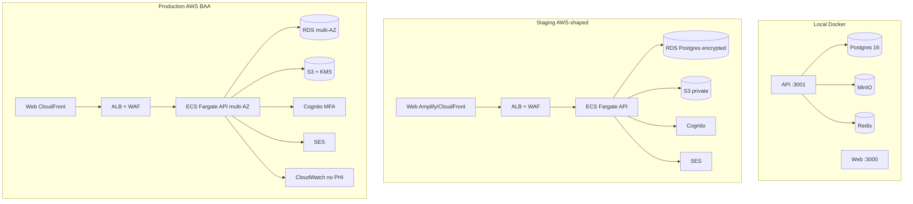

# HHOS Phase 9 — Platform Productization

**Status:** Implementation-ready design  
**Scope:** Home health + hospice multi-tenant SaaS platform (no longevity)  
**Stack:** pnpm monorepo · NestJS API · Next.js web · Expo mobile · Postgres + Drizzle · MinIO/S3  
**Depends on:** Phases 0–8 on `main` (intake → billing readiness + RLS + go-live checklist)

---

## 1. Context

HHOS is a HIPAA-by-design **Home Health + Hospice Operating System**. Phases 0–8 delivered domain product (intake, consents, wound photos, OASIS/PDGM advisory, HITL routing, orders/485 e-sign, hospice elections/LOC/cert, billing readiness/export) and multi-tenant isolation foundations (`org_id`, invites, org settings/flags, Postgres RLS + `hhos_app`).

What remains is **productizing the platform**: an agency can **onboard, operate, and go live** without engineering hand-holding—real identity (Cognito), outbound email for invites and physician sign links, production deploy topology, observability without PHI, enforced RLS runtime, operator UX, and compliance gates aligned with `docs/compliance/go-live-checklist.md`.

### 1.1 Goals

| # | Goal | Success criteria |
|---|------|------------------|
| G1 | **Ship multi-tenant SaaS foundations** | Staging + prod topology documented and scriptable; env/config matrix complete |
| G2 | **Production identity path** | `AUTH_PROVIDER=cognito` validates JWKS; MFA for admin/compliance/break-glass; org-scoped app sessions |
| G3 | **Close notification hangups** | Invites + physician magic-links emailed via BAA provider; tokens remain hashed at rest; minimal PHI in messages |
| G4 | **Agency operator experience** | Guided onboarding wizard; role-based shell nav; break-glass procedures documented |
| G5 | **Security & compliance platform** | `FEATURE_RLS=true` + `hhos_app` mandatory in staging/prod; cross-tenant isolation as release gate; BAA inventory current |
| G6 | **Observability & DR** | Structured non-PHI logs, health/readiness, basic metrics; Postgres + object-storage backup/restore expectations |

### 1.2 Non-goals (explicit)

| Non-goal | Why / when |
|----------|------------|
| Live EDI 837 auto-submit | Phase 7 is readiness + JSON export only; never auto-submit claims |
| Full CMS form builders (structured 485 UI) | PDF upload + e-sign remains the path |
| Longevity / wellness modules | Product constraint: home health + hospice only |
| Per-org KMS CMK for photo KEK | **Phase 9.1+** — platform-wide KEK/KMS in Phase 9 MVP |
| Full platform super-admin multi-tenant console | Minimal break-glass runbook only; console deferred |
| DocuSign / Adobe Sign | Magic-link e-sign stays in-house |
| SMS notifications | Optional later; design leaves a provider interface |
| Auto-sign or auto-finalize clinical/billing decisions | HITL forever |

### 1.3 Product constraints (mandatory)

1. **Home health and hospice only** — no longevity modules.  
2. **HIPAA-by-design** — synthetic data only in non-prod.  
3. **HITL** for clinical/billing decisions — never auto-sign or auto-submit claims.  
4. Build on existing monorepo stack; do not redesign Phases 0–8 domains from scratch.

---

## 2. Current state (shipped on main)

### 2.1 Domain phases

| Phase | Delivered |
|-------|-----------|
| 0–1 | Intake, consents, RBAC, audit, SOC tracking |
| 2 | Secure wound photos (envelope crypto, outbox, dual S3) |
| 3 | OASIS-E2 subset + PDGM advisory |
| 4 | Service AI routing HITL + field tasks |
| Multi-tenant | Org create, invites, members, per-org settings/flags |
| 5 | Orders/485 packages + physician magic-link e-sign |
| 6 | Hospice elections, LOC, benefit periods, cert packages |
| 7 | Billing readiness + JSON claim export |
| 8 | Postgres RLS + `hhos_app` + `FEATURE_RLS` + go-live checklist |

### 2.2 Platform gaps Phase 9 closes

| Area | Today | Phase 9 target |
|------|-------|----------------|
| Auth | Local JWT; Cognito path throws `AUTH_NOT_CONFIGURED` | Cognito JWKS validation + MFA policy |
| Invites / sign links | Raw token returned in API; staff copies URL | Email delivery; token only in link (hashed at rest) |
| Deploy | Docker Compose local; Terraform stub | Local / staging / prod topology + env matrix |
| Observability | Nest default logs; thin `/health` | Structured JSON logs (no PHI), readiness, metrics |
| Operator UX | Flat nav; one-shot `/onboard` create org | Wizard + role-based shell |
| RLS runtime | Implemented but `FEATURE_RLS=false` local default | Enforced staging/prod gates + isolation tests |
| Notifications | None | Pluggable email provider (SES primary) |
| Backups | Undocumented | Postgres + S3 restore expectations |

### 2.3 Key existing contracts (do not break)

**Auth JWT claims (local & app session):**

```ts
{ sub, orgId, email, fullName, roles, permissions }
```

**Org bootstrap:** `POST /v1/orgs` → org + admin + JWT  
**Invites:** `POST /v1/orgs/me/invites` returns `inviteToken` (dev); accept via `POST /v1/invites/accept`  
**Physician sign:** `POST /v1/order-packages/:id/send` returns `signUrl` / `signToken` (dev); public `GET|POST /v1/sign/:token`  
**RLS:** `FEATURE_RLS=true` → request transaction + `app.current_org_id` / `app.rls_bypass`; runtime role `hhos_app`  
**Feature flags:** Platform env `FEATURE_*` kill switch AND org `settings.features.*`

---

## 3. Proposed architecture

### 3.1 Logical architecture

```text
┌──────────────────────────────────────────────────────────────────────────┐
│                         Clients (TLS only)                               │
│  Next.js Web Console          Expo Field App          Physician Sign UI  │
└────────────┬─────────────────────────┬───────────────────────┬───────────┘
             │ Bearer (app JWT)        │ Bearer (app JWT)      │ magic token
             ▼                         ▼                       ▼
┌──────────────────────────────────────────────────────────────────────────┐
│                         NestJS API (ECS/Fargate)                         │
│  AuthGuard (Cognito JWKS → app claims) │ RlsInterceptor │ RBAC guards  │
│  Domain modules (patients…billing)     │ Notifications  │ Audit        │
└─────┬───────────────────┬───────────────────┬────────────────────────────┘
      │                   │                   │
      ▼                   ▼                   ▼
┌───────────┐      ┌────────────┐      ┌─────────────────┐
│ RDS       │      │ S3 private │      │ SES (BAA)       │
│ Postgres  │      │ + KMS      │      │ invites/sign    │
│ hhos_app  │      │ photos/docs│      │ (no PHI body)   │
│ RLS FORCE │      └────────────┘      └─────────────────┘
└───────────┘
      ▲
      │ migrate/seed as owner role only
┌───────────┐      ┌────────────┐
│ Cognito   │      │ Secrets    │
│ User Pool │      │ Manager /  │
│ + MFA     │      │ SSM        │
└───────────┘      └────────────┘
```

### 3.2 Deploy topology



| Environment | Compute | DB role for API | Storage | Auth | Email | PHI |
|-------------|---------|-----------------|---------|------|-------|-----|
| **local** | `pnpm dev` + Compose | `hhos` (owner) or optional `hhos_app` | MinIO | `AUTH_PROVIDER=local` | Console/log sink | Synthetic only |
| **staging** | ECS Fargate (or single EC2 dogfood) | **`hhos_app` required** | Private S3 | Cognito | SES sandbox / verified domain | Synthetic only |
| **prod** | ECS Fargate multi-AZ | **`hhos_app` required** | Private S3 + KMS | Cognito + MFA | SES production | Real ePHI only after BAAs + checklist |

**Deploy unit decision (MVP):**  
- **API** — container from existing `apps/api/Dockerfile` (build monorepo deps, run `dist/main.js`).  
- **Web** — Next.js static/SSR deploy (Vercel-like or Amplify/CloudFront+Lambda); separate unit from API.  
- **Mobile** — EAS builds; no server deploy.  
- **DB migrate** — one-off task / CI job as **owner** role (`hhos`), never as `hhos_app`.  

Rationale: keep monorepo; ship independently reviewable units; avoid coupling web rebuilds to API deploys.

### 3.3 Component map (new vs extend)

| Component | Action | Location |
|-----------|--------|----------|
| `NotificationsModule` | **New** | `apps/api/src/notifications/` |
| `EmailProvider` interface + SES + Console | **New** | `apps/api/src/notifications/providers/` |
| `AuthGuard` Cognito JWKS | **Extend** | `apps/api/src/common/auth.guard.ts` |
| `AuthService` session exchange / token issue | **Extend** | `apps/api/src/auth/` |
| `OrgsService.invite` → send email | **Extend** | `apps/api/src/orgs/` |
| `OrdersService.send` → send email | **Extend** | `apps/api/src/orders/` |
| Structured logger | **New/extend** | `apps/api/src/common/logger.ts` |
| Health readiness | **Extend** | `apps/api/src/health/` |
| `notification_deliveries` table | **New** | `packages/db` migration |
| Onboarding wizard UI | **Extend** | `apps/web` `/onboard` multi-step |
| App shell + role nav | **Extend** | `apps/web` layout/components |
| Terraform modules | **Extend** | `infra/terraform/` (staging-shaped) |
| Env matrix docs + `.env.example` | **Extend** | root |
| Cross-tenant isolation test | **New** | `packages/db` or `apps/api` CI gate |

---

## 4. Detailed design

### 4.1 Env / config matrix

#### 4.1.1 Auth & sessions

| Variable | Local | Staging | Prod | Notes |
|----------|-------|---------|------|-------|
| `AUTH_PROVIDER` | `local` | `cognito` | `cognito` | Dev login disabled when `cognito` |
| `JWT_SECRET` | required | required | required (Secrets Manager) | Signs **app** JWT after Cognito identity proof |
| `JWT_EXPIRES_IN` | `8h` | `1h` | `1h` | Short-lived app tokens in stage/prod |
| `COGNITO_USER_POOL_ID` | — | set | set | |
| `COGNITO_CLIENT_ID` | — | set | set | Public SPA / mobile client |
| `COGNITO_REGION` | — | set | set | |
| `COGNITO_ISSUER` | — | derived or explicit | same | `https://cognito-idp.{region}.amazonaws.com/{poolId}` |
| `SESSION_IDLE_TIMEOUT_MINUTES` | `480` | `30` | `30` | Web idle policy (client + optional server claim `iat`) |
| `MFA_REQUIRED_ROLES` | — | `admin,compliance` | `admin,compliance` | Comma list; also force if user.mfaRequired |
| `WEB_PUBLIC_URL` | `http://localhost:3000` | staging URL | prod URL | Invite + sign link base |
| `API_CORS_ORIGINS` | localhost | staging origins | prod origins | Comma-separated |

#### 4.1.2 Database & RLS

| Variable | Local | Staging | Prod |
|----------|-------|---------|------|
| `DATABASE_URL` (API runtime) | `postgresql://hhos:…` OK | **`postgresql://hhos_app:…`** | **`postgresql://hhos_app:…`** |
| `DATABASE_URL` (migrate/seed) | owner `hhos` | owner | owner |
| `DATABASE_APP_PASSWORD` | `hhos_app_dev` | secret | secret |
| `FEATURE_RLS` | `false` (dogfood) | **`true`** | **`true`** |

**Boot guard (new):** When `NODE_ENV=production` **or** `HHOS_ENV` ∈ {`staging`,`production`}:

1. Fail start if `FEATURE_RLS !== true`.  
2. Fail start if `AUTH_PROVIDER !== cognito`.  
3. Warn/fail if DB user is superuser (optional check via `SELECT current_setting('is_superuser')` / role attributes).  
4. Fail start if required secrets missing (`JWT_SECRET`, `PHOTO_KEK`, Cognito ids, email config when `EMAIL_PROVIDER!=console`).

Local remains permissive for developer velocity.

#### 4.1.3 Feature flags (platform kill switches)

| Flag | Staging default | Prod guidance |
|------|-----------------|---------------|
| `FEATURE_RLS` | **true** | **true** |
| `FEATURE_ORDERS_ESIGN` | true | true when using 485/orders |
| `FEATURE_HOSPICE` | true | per agency product |
| `FEATURE_BILLING` | true | readiness/export only |
| `FEATURE_OASIS` | true | after item-set compliance approval |
| `FEATURE_WOUND_PHOTOS` | true (synthetic) | only after photo BAAs + KEK custody |
| `FEATURE_SERVICE_AI` | true | only with HITL policy + BAA if LLM |
| `FEATURE_PHOTO_BYTES_VIA_API` | false | **false always with PHI** |
| `PHOTO_GEOTAG_ENABLED` | false | false unless dual-gated org setting |

Org overrides remain in `organizations.settings.features` (existing).

#### 4.1.4 Notifications

| Variable | Description | Default |
|----------|-------------|---------|
| `EMAIL_PROVIDER` | `console` \| `ses` \| `sendgrid` | `console` local; `ses` stage/prod |
| `EMAIL_FROM` | Verified sender, e.g. `noreply@hhos.example` | required if not console |
| `EMAIL_REPLY_TO` | Optional support address | optional |
| `AWS_REGION` / SES region | SES send region | same as app region |
| `SES_CONFIGURATION_SET` | Optional for event tracking | optional |
| `SENDGRID_API_KEY` | Only if `EMAIL_PROVIDER=sendgrid` | — |
| `NOTIFICATION_RETRY_MAX` | Delivery attempts | `5` |
| `INVITE_EMAIL_ENABLED` | Gate invite email | `true` when provider ≠ console in stage/prod |
| `SIGN_LINK_EMAIL_ENABLED` | Gate physician email | `true` same |

#### 4.1.5 Storage, crypto, ops

Unchanged from `.env.example` with prod guidance:

- `S3_*` → real AWS; no public ACL; dual endpoint only if needed for devices.  
- `FIELD_ENCRYPTION_KEY` / `PHOTO_KEK` — distinct secrets per env; never reuse.  
- `LOG_LEVEL` — `info` stage/prod; `debug` local only.  
- `HHOS_ENV` — `local` \| `staging` \| `production` (new; drives boot guards).

### 4.2 Identity & access (production path)

#### 4.2.1 Alternatives considered

| Option | Pros | Cons | Decision |
|--------|------|------|----------|
| **AWS Cognito** | Already in go-live checklist + BAA inventory; MFA native; fits AWS topology | UX less polished than Auth0 | **Select for MVP** |
| Auth0 / Okta | Excellent DX, org features | Extra BAA, cost, second IdP | Later if enterprise SSO demand |
| Custom password auth | Full control | HIPAA auth burden high | **Reject** |

#### 4.2.2 Identity model

Cognito holds **authentication** (password, MFA, recovery). HHOS Postgres holds **authorization** (org membership, roles, permissions, caseload).

```text
User signs in (Cognito Hosted UI or Amplify Auth)
        │
        ▼
  Cognito ID/Access JWT (sub = cognitoSub)
        │
        ▼
POST /v1/auth/session   { idToken }  (or Authorization: Cognito Bearer once)
        │
        ▼
API verifies Cognito JWT via JWKS
Lookup users where cognito_sub = sub AND status=active
  - 0 matches → 401 USER_NOT_PROVISIONED
  - 1 match  → issue app JWT with orgId/roles/permissions
  - N matches → 409 ORG_SELECTION_REQUIRED { organizations[] }
        │  (client retries with orgId)
        ▼
App JWT (short-lived) used for all domain APIs
```

**Keep org-scoped app JWT claims** exactly as today so mobile/web/guards remain stable.

#### 4.2.3 API shapes

**`POST /v1/auth/session`** (public; RLS bypass)

Request:

```json
{
  "idToken": "<cognito JWT>",
  "orgId": "<uuid optional>"
}
```

Response (success): same shape as `devLogin` today:

```json
{
  "accessToken": "<app JWT>",
  "tokenType": "Bearer",
  "user": { "id", "orgId", "email", "fullName", "roles", "permissions" },
  "organization": { "id", "name", "slug" }
}
```

Errors:

| Code | HTTP | When |
|------|------|------|
| `DEV_LOGIN_DISABLED` | 401 | `dev-login` when `AUTH_PROVIDER=cognito` (existing) |
| `INVALID_ID_TOKEN` | 401 | JWKS/signature/aud/iss fail |
| `USER_NOT_PROVISIONED` | 401 | No active user for `cognitoSub` |
| `USER_DISABLED` | 401 | status disabled |
| `ORG_SELECTION_REQUIRED` | 409 | Multi-org email/sub; need `orgId` |
| `MFA_REQUIRED` | 403 | Role requires MFA but token `amr`/`auth_time` policy fails (see below) |

**`POST /v1/auth/dev-login`** — unchanged; only when `AUTH_PROVIDER=local`.

**`GET /v1/me`** — unchanged (app JWT).

#### 4.2.4 AuthGuard behavior

```text
if AUTH_PROVIDER=local:
  verify HS256 app JWT with JWT_SECRET  (current)

if AUTH_PROVIDER=cognito:
  verify HS256 app JWT with JWT_SECRET  (app session tokens only)
  // Cognito tokens are NOT accepted on domain routes — only on /auth/session
```

Rationale: domain RBAC depends on **HHOS roles/permissions** embedded in app JWT; Cognito groups would duplicate and drift. Single exchange endpoint maps identity → authorization.

**JWKS client:** cache keys (e.g. `jose` or `jwks-rsa`), validate `iss`, `aud`/`client_id`, `exp`, `token_use` (`id`).

#### 4.2.5 MFA policy

| Role / flag | MFA |
|-------------|-----|
| `admin` | Required in staging/prod |
| `compliance` | Required |
| User `mfaRequired=true` | Required (incl. break-glass accounts) |
| Other roles | Recommended; org may require later |

Implementation:

1. Cognito User Pool: MFA **optional** at pool level, **required** via adaptive policy or post-auth check.  
2. On session exchange: if user roles intersect `MFA_REQUIRED_ROLES` or `users.mfa_required`, require Cognito token to show MFA satisfaction (`amr` includes `mfa` / Cognito challenge claims — map per Cognito token shape).  
3. If not satisfied → `403 MFA_REQUIRED` with message to complete MFA in Hosted UI.  
4. Org create admin and invites for admin/compliance set `mfaRequired=true` when `HHOS_ENV!=local`.

#### 4.2.6 Session policy

| Policy | Value |
|--------|-------|
| App JWT TTL | staging/prod `1h`; local `8h` |
| Refresh | Client re-runs Cognito refresh → `POST /v1/auth/session` (no long-lived refresh of app JWT server-side in MVP) |
| Web idle timeout | `SESSION_IDLE_TIMEOUT_MINUTES` (default 30 stage/prod); clear localStorage session; re-auth |
| Mobile | Secure store for tokens; same TTL; biometric optional later |
| Logout | Client discard tokens; optional Cognito global sign-out later |

#### 4.2.7 Provisioning flows

| Flow | Behavior |
|------|----------|
| **Create org** (`POST /v1/orgs`) | Creates org + admin user. Staging/prod: either (A) admin must already exist in Cognito with matching email, link `cognitoSub` on first session; or (B) API AdminCreateUser (server IAM) after org create. **MVP: (A) + invite/link on first login** for staff; org create stores email and sets `cognitoSub` null until first session match by email+invite activation. |
| **Invite** | Creates/updates `users` invited + hashed token; emails link. Accept activates user; first Cognito login binds `cognitoSub` if empty (email must match). |
| **Dev local** | Keep `cognitoSub: local-…` placeholders; no Cognito. |

**Binding algorithm on session:**

1. Verify Cognito token → `sub`, `email` (verified).  
2. If `orgId` provided: find user by `(orgId, email)` or `(orgId, cognitoSub)`.  
3. Else: find all active users with `cognitoSub=sub` OR (`cognitoSub` null/invite placeholder AND email match).  
4. On match with null/placeholder sub → set `cognitoSub=sub` (audit `user.cognito_link`).  
5. Issue app JWT.

#### 4.2.8 Break-glass

Existing permission `break_glass:phi` stays. Platform procedures:

1. Dedicated compliance user with `mfaRequired=true` and short JWT TTL.  
2. Service layer already audits break-glass photo views; extend pattern for any future cross-caseload reads.  
3. **No cross-tenant break-glass in MVP.** Support access to another org requires separate runbook (DB owner + ticket), not an API god-mode.  
4. Document in §4.6 and go-live checklist.

### 4.3 Outbound notifications

#### 4.3.1 Goals

Close real-world hangups:

1. Org staff invites.  
2. Physician sign links (485 / orders / hospice cert packages).

Optional SMS is **interface-ready, not implemented**.

#### 4.3.2 Provider alternatives

| Provider | Pros | Cons | Decision |
|----------|------|------|----------|
| **Amazon SES** | Same AWS BAA surface; cheap; config sets | Deliverability setup | **Primary** |
| SendGrid | Simple API, templates | Separate BAA | Secondary adapter |
| Console / log | Local dogfood | Not real email | Default local |

#### 4.3.3 Module design

```text
apps/api/src/notifications/
  notifications.module.ts
  notifications.service.ts      # enqueue + send + audit
  templates/
    invite.ts
    physician-sign.ts
  providers/
    email-provider.ts           # interface
    console.email-provider.ts
    ses.email-provider.ts
    sendgrid.email-provider.ts  # stub optional
  notifications.controller.ts   # optional admin resend (later)
```

**Interface:**

```ts
export type EmailMessage = {
  to: string;
  subject: string;
  textBody: string;
  htmlBody?: string;
  tags?: Record<string, string>; // orgId, template, deliveryId — no PHI
};

export interface EmailProvider {
  send(message: EmailMessage): Promise<{ providerMessageId: string }>;
}
```

#### 4.3.4 Persistence: `notification_deliveries`

New table (migration `0009_notification_deliveries.sql`):

| Column | Type | Notes |
|--------|------|-------|
| `id` | uuid PK | |
| `org_id` | uuid NOT NULL | RLS-scoped |
| `channel` | enum `email` \| `sms` | sms unused MVP |
| `template` | text | `org_invite` \| `physician_sign` |
| `to_address` | text | email; **not** patient name |
| `status` | enum `pending` \| `sent` \| `failed` \| `suppressed` | |
| `provider` | text | `console` \| `ses` \| … |
| `provider_message_id` | text null | |
| `attempt_count` | int | |
| `last_error_code` | text null | no raw provider body with PHI |
| `related_type` | text | `org_invite` \| `signature_request` |
| `related_id` | uuid | |
| `created_at` / `updated_at` / `sent_at` | timestamptz | |

- FORCE RLS with same org policies as other tables.  
- **Do not store** magic raw tokens, patient names, DOB, or note-to-physician free text in this table.  
- Audit events: `notification.send`, `notification.fail` with ids only.

#### 4.3.5 PHI minimization in messages

| Field | Allowed | Forbidden |
|-------|---------|-----------|
| Subject (invite) | `You're invited to {orgName} on HHOS` | Patient names |
| Subject (sign) | `Signature requested — {orgName}` | Patient full name, MRN, diagnosis |
| Body | Org name, role, link, expiry, physician last name optional | Full patient name; use **initials + DOB year** only if needed (align with public sign page) |
| Link | `{WEB_PUBLIC_URL}/invite?token=…` or `/sign/{token}` | Token in query logs |

**Email templates (text):**

**Invite:**

```text
You have been invited to join {orgName} as {roleLabel}.

Accept your invite (expires {expiresAt UTC}):
{acceptUrl}

If you did not expect this message, ignore it.
```

`acceptUrl = ${WEB_PUBLIC_URL}/invite?token=${rawToken}`

**Physician sign:**

```text
{orgName} requests your signature on a {docTypeLabel}.

Open secure link (expires {expiresAt UTC}):
{signUrl}

Patient reference: {patientInitials}, DOB year {dobYear}
Physician: {physicianName}

Do not forward this link. Questions: contact the agency (not this mailbox).
```

No attachment of clinical PDF in email MVP (PDF remains behind authenticated/sign flow).

#### 4.3.6 Integration points

**`OrgsService.invite`** after DB commit:

```ts
await this.notifications.sendOrgInvite({
  orgId, inviteId, to: email, orgName, roleCode, rawToken, expiresAt,
});
// Response changes:
// - staging/prod with email on: omit inviteToken (or include only if EMAIL_EXPOSE_TOKEN=true for support)
// - local console: keep inviteToken for DX
```

Response contract (backward compatible):

```json
{
  "invite": { "id", "email", "fullName", "roleCode", "status", "expiresAt" },
  "delivery": { "id", "status", "channel": "email" },
  "inviteToken": "<only if EMAIL_PROVIDER=console or HHOS_ENV=local>",
  "acceptPath": "/v1/invites/accept",
  "note": "…"
}
```

**`OrdersService.send`** after creating `signature_requests`:

```ts
await this.notifications.sendPhysicianSign({
  orgId, signatureRequestId, to: pkg.physicianEmail,
  orgName, docType, physicianName, patientInitials, dobYear, rawToken, expiresAt,
});
```

Response:

```json
{
  "package": { … },
  "signatureRequestId": "…",
  "expiresAt": "…",
  "delivery": { "id", "status", "channel": "email" },
  "signUrl": "<only local/console or if send failed for staff copy>",
  "note": "…"
}
```

**Resend:** `POST /v1/orgs/me/invites/:id/resend` and `POST /v1/order-packages/:id/resend-sign` (permissions `user:admin` / `order:send`). Rotates token (hash new; revoke old) — safer than re-sending same token.

#### 4.3.7 Delivery reliability (MVP)

- **Synchronous send** in request path for MVP simplicity (SES latency OK).  
- On failure: mark delivery `failed`, still return 200 for domain action if DB committed; include `delivery.status=failed` and fallback `signUrl`/`inviteToken` for staff so workflow is not blocked.  
- Audit failure. Optional: in-process retry queue later (Redis exists).  
- Never log full email body or tokens.

### 4.4 RLS runtime (staging/prod)

#### 4.4.1 Existing behavior (keep)

From Phase 8:

- FORCE RLS policies on org-scoped tables.  
- `FEATURE_RLS=true` → `RlsInterceptor` opens transaction, `applyRlsConfig`, ALS-bound Drizzle.  
- Authenticated: `app.current_org_id = JWT.orgId`, bypass off.  
- Unauthenticated public routes: bypass on (health, create org, dev-login, provider sign, **auth/session**, invite peek/accept).

#### 4.4.2 Phase 9 hardening

1. **Boot guards** (§4.1.2).  
2. **CI release gate:** automated cross-tenant test (see §8).  
3. **Public route allowlist** documented and unit-tested so new public endpoints cannot forget bypass vs org binding.  
4. **Provider sign path:** public token lookup by `token_hash` must run under bypass; after load, assert package org consistency; never set `current_org_id` from client input.  
5. **Migrate job** never uses `hhos_app` as migrator.  
6. **Readiness probe** checks: DB connect as app role + optional `SELECT` with RLS enforced smoke.

#### 4.4.3 Public routes (RLS bypass)

| Route | Reason |
|-------|--------|
| `GET /health`, `GET /ready` | Probes |
| `POST /v1/orgs` | Bootstrap (creates org; no prior org context) |
| `POST /v1/auth/dev-login` | Local only |
| `POST /v1/auth/session` | Cognito exchange |
| `GET /v1/invites/peek`, `GET /v1/invites/:token`, `POST /v1/invites/accept` | Invite token |
| `GET|POST /v1/sign/:token` | Physician magic link |

All other routes require app JWT + org RLS.

### 4.5 Operator / agency admin experience

#### 4.5.1 Onboarding wizard

Replace single-form `/onboard` with multi-step wizard (client-side steps; existing APIs):

| Step | UI | API |
|------|----|-----|
| 1. Create org | name, slug, timezone, NPI optional, admin email/name | `POST /v1/orgs` |
| 2. Auth setup | Local: done. Cognito: "Sign in with Cognito to link admin" → `POST /v1/auth/session` | session |
| 3. Modules | toggles for org `settings.features` (wound, OASIS, service AI, orders, hospice, billing) | `PATCH /v1/orgs/me` |
| 4. Invite staff | email, name, role | `POST /v1/orgs/me/invites` |
| 5. First patient path | deep-link to `/patients/new` + intake checklist tip | existing patient/referral APIs |

Persist wizard progress in `sessionStorage` only (no new table). Mark complete client-side when step 5 visited.

#### 4.5.2 Platform shell & role-based nav

Refactor `apps/web` layout:

- Shared `AppShell` with org name from session.  
- Nav items filtered by **permissions** (from session user), not hard-coded full list:

| Nav item | Permission gate |
|----------|-----------------|
| Dashboard | authenticated |
| Intake | `referral:create` or `patient:write` |
| OASIS | `oasis:read` + platform/org OASIS on |
| Routing | `routing:read` |
| Field tasks | `visit_task:read` |
| Orders / 485 | `order:read` |
| Hospice | `hospice:read` |
| Billing | `billing:read` |
| Clinical tasks | `clinical_task:read` |
| Admin | `user:admin` or `org:settings` |
| Onboard | unauthenticated / marketing only |

Hide modules when org feature flags off (fetch `GET /v1/orgs/me` when admin; for staff, fail closed on API already — hide nav if 403 pattern known).

#### 4.5.3 Admin console extensions

Existing `/admin`: members + invites + settings. Phase 9 adds:

- Delivery status for last invites (from invite list + optional delivery join).  
- "Resend invite" button.  
- MFA required badges for admin/compliance.  
- Link to go-live checklist (docs) for agency readiness self-view (static content).

### 4.6 Support / break-glass procedures (design-level)

| Scenario | Procedure |
|----------|-----------|
| Physician cannot open sign link | Staff: Orders worklist → Resend (rotates token) → confirm email; check `notification_deliveries`; support verifies expiry without opening PHI |
| Staff invite expired | Admin resend invite |
| User locked in Cognito | IdP reset; no PHI in ticket |
| Suspected cross-tenant leak | Incident: disable tokens; pull audit by `requestId`; run isolation test suite; engage IR contacts from checklist |
| Break-glass PHI view | Compliance role + MFA + reason code (existing photo path); audit `view_break_glass` |
| Cross-tenant support | **Not in app.** Ticket + owner DB access with `app.rls_bypass` session under change control; dual control preferred |
| Lost device | Device revoke API (Phase 2); Cognito global sign-out if available |

### 4.7 Observability

#### 4.7.1 Structured logging

Replace ad-hoc `console.log` on hot paths with JSON logger:

```json
{
  "level": "info",
  "time": "…",
  "service": "hhos-api",
  "requestId": "…",
  "orgId": "…",
  "userId": "…",
  "route": "POST /v1/patients",
  "status": 201,
  "durationMs": 42,
  "msg": "request completed"
}
```

Rules:

- Never log names, DOB, MRN, addresses, diagnosis text, photo bytes, DEKs, tokens, Authorization headers.  
- Reuse/extend `redact.ts` for any structured error context.  
- CloudWatch: log group per env; retention 30–90 days per policy.

#### 4.7.2 Health endpoints

| Endpoint | Auth | Checks |
|----------|------|--------|
| `GET /health` | public | process up (existing) |
| `GET /ready` | public | DB `SELECT 1`; optional S3 head bucket; report `rls: FEATURE_RLS`, `auth: AUTH_PROVIDER`, `email: EMAIL_PROVIDER` **flags only** |

#### 4.7.3 Metrics (MVP)

Minimal:

- Request count / latency histogram by route template (no query strings).  
- 5xx rate.  
- Notification send success/fail counters by template.  
- Auth session success/fail (no email in labels).

Implementation: Prometheus-style `/metrics` **internal-only** (not public ALB) **or** CloudWatch Embedded Metric Format. Prefer CloudWatch custom metrics in AWS to avoid exposing `/metrics`.

### 4.8 Backup / restore expectations

| Asset | Backup | RPO / RTO targets (initial) | Restore drill |
|-------|--------|----------------------------|---------------|
| Postgres (RDS) | Automated daily snapshots + PITR | RPO ≤ 24h (PITR better); RTO ≤ 4h | Quarterly restore to isolated instance; run migrations; smoke test with synthetic |
| S3 documents/photos | Versioning + cross-AZ; optional replication | RPO ≈ 0 for versioned delete; RTO ≤ 4h | Restore object sample; verify decrypt path with synthetic photo |
| Secrets | Secrets Manager versioning | — | Rotate runbook |
| Cognito | AWS-managed | — | Export user list not required MVP |

**Application notes:**

- Soft-deleted clinical rows remain in DB backups.  
- Photo ciphertext without DB DEK wrap rows is useless — restore DB + S3 together.  
- Document restore steps in `docs/compliance/go-live-checklist.md` operational section (Phase 9 PR updates checklist).

### 4.9 Security & compliance platform

1. Enforce `FEATURE_RLS=true` + `hhos_app` in staging/prod (boot guard).  
2. Cross-tenant isolation verification as **CI release gate** + pre-go-live manual sign-off.  
3. Update `docs/compliance/baa-inventory.md`:  
   - AWS (hosting, RDS, S3, KMS, Cognito, SES, CloudWatch)  
   - Email: SES (not TBD)  
   - Remove "Email provider TBD" once SES chosen  
4. Align go-live checklist: checkboxes for notifications, Cognito MFA, backup drill, isolation test green.  
5. Never enable live claim submit or auto-sign flags (do not add such flags).

### 4.10 Terraform / infra (staging-shaped MVP)

Expand `infra/terraform` beyond stub:

| Module | Purpose |
|--------|---------|
| `vpc` | Private subnets, no public RDS |
| `rds` | Postgres 16 encrypted, `hhos` owner + `hhos_app` |
| `s3` | Private bucket, block public access, TLS |
| `ecs_api` | Fargate service, task role for S3/SES/SSM |
| `cognito` | User pool, app client, MFA optional/required config |
| `ses` | Domain identity (manual DNS may remain out-of-band) |
| `secrets` | JWT, KEK, DB URLs |
| `alb` | HTTPS, WAF association optional |

Phase 9 MVP can land **module scaffolding + staging apply runbook** without requiring full prod multi-account. Code must not assume real PHI.

---

## 5. Threats & mitigations (brief)

| # | Threat | Mitigation |
|---|--------|------------|
| P1 | Cross-tenant data access | RLS FORCE + app filters + isolation CI gate + `hhos_app` |
| P2 | Magic-link token theft | SHA-256 at rest; HTTPS only; expiry; rotate on resend; minimal PHI on page |
| P3 | Invite/sign email interception | Short TTL; no PDF/PHI in email; link single-purpose |
| P4 | Cognito token used as app auth without RBAC | Domain routes accept only app JWT after session exchange |
| P5 | MFA bypass on admin | Session exchange enforces MFA for privileged roles |
| P6 | PHI in logs/metrics | Structured logger + redact; metric labels ids only |
| P7 | Superuser DB in prod | Boot check; runbooks use `hhos_app` |
| P8 | SES account abuse / spoofing | Verified domain; SPF/DKIM; rate limits; BAA |
| P9 | Support god-mode abuse | No cross-tenant API; break-glass audited; dual control for DB |
| P10 | Session fixation / long-lived tokens | 1h JWT stage/prod; idle timeout; Cognito re-auth |

---

## 6. Migration / rollout plan

### 6.1 Sequence

```text
PR1 Foundations (env, logger, health/ready, boot guards)
    → PR2 notification_deliveries + EmailProvider + templates
        → PR3 wire invite + sign send/resend
    → PR4 Cognito JWKS + /auth/session + web/mobile login path
        → PR5 MFA policy + mfaRequired defaults
    → PR6 Onboarding wizard + role-based shell
    → PR7 Isolation tests + CI gate + checklist/BAA updates
    → PR8 Terraform staging modules + deploy runbook
```

### 6.2 Data migration

- `notification_deliveries`: new table only; no backfill.  
- `users.cognito_sub`: existing local placeholders remain; Cognito bind updates on first login.  
- No change to order package or invite hash algorithms.  
- Optional: set `mfa_required=true` for admin/compliance via data migration when `HHOS_ENV` promotes (script, not blind prod update).

### 6.3 Environment promotion

| Stage | Actions |
|-------|---------|
| Local | `EMAIL_PROVIDER=console`, `AUTH_PROVIDER=local`, `FEATURE_RLS` optional true for dogfood with `hhos_app` |
| Staging | Cognito pool, SES sandbox, `FEATURE_RLS=true`, synthetic e2e onboarding + sign email |
| Prod | BAAs signed; checklist complete; MFA on; backups drill; isolation green; then real PHI |

### 6.4 Rollback

- Feature flags: set `EMAIL_PROVIDER=console` or disable send flags to stop outbound mail without redeploy.  
- Auth: keep `AUTH_PROVIDER=local` **only** in non-prod; prod rollback is previous task definition + Cognito still required by boot guard (do not silently disable Cognito in prod).  
- Schema: deliveries table additive; safe to leave.

---

## 7. Testing strategy

| Layer | What |
|-------|------|
| Unit | Email template PHI assertions (no full name); feature flags; boot guard matrix; MFA role check; redact logger |
| Integration | Invite → delivery row → provider mock; send package → sign email; Cognito JWT mock JWKS; session multi-org |
| RLS / isolation | Two orgs A/B; token A cannot read B patients/episodes/packages; public sign token only for its package |
| E2E (synthetic) | Onboard wizard → invite accept → create patient → order send → open sign link |
| CI gates | typecheck, unit, **isolation test required**, no PHI linter on logs (existing patterns) |
| Manual go-live | Checklist items; restore drill; pen-test as applicable |

**Isolation test sketch:**

```ts
// packages/db or apps/api
// FEATURE_RLS=true, DATABASE_URL=hhos_app
// seed orgA patientA, orgB patientB
// withRlsContext({ orgId: A }) → select patients → only A
// withRlsContext({ orgId: B }) → cannot see A
// API: bearer A on GET /v1/patients/:idB → 404
```

---

## 8. Key Decisions

| ID | Decision | Rationale |
|----|----------|-----------|
| **D1** | **Cognito for production IdP** (not Auth0/Okta in MVP) | Matches go-live checklist, AWS BAA inventory, and planned Terraform; sufficient MFA |
| **D2** | **App JWT after Cognito session exchange** (domain routes do not accept raw Cognito tokens) | Preserves org-scoped RBAC claims; avoids dual authorization models; mobile/web guards unchanged |
| **D3** | **Amazon SES primary email provider** with Console + optional SendGrid adapters | Same cloud BAA; pluggable interface; local dogfood without SES |
| **D4** | **Minimal PHI in email** (org name, link, optional initials + DOB year) | Reduces breach impact of email compromise; aligns with public sign page rules |
| **D5** | **Tokens remain hashed at rest**; raw only in email link / local console response | Existing invite + signature design; email does not change storage |
| **D6** | **Synchronous email send in MVP** with failed delivery fallback URL for staff | Unblocks agencies even if SES fails; avoids building queue infra in same phase |
| **D7** | **Boot-fail if staging/prod without `FEATURE_RLS` + Cognito** | Prevents accidental PHI deploy on weak isolation/auth |
| **D8** | **API runtime must use `hhos_app`** in staging/prod | Superusers ignore RLS; Phase 8 design |
| **D9** | **No cross-tenant super-admin API in Phase 9** | Support via runbook; reduces blast radius |
| **D10** | **Per-org KMS deferred to 9.1+** | Platform KEK sufficient for first agencies; CMK multiplies ops cost |
| **D11** | **Separate deploy units: API container, Web, migrate job** | Independent rollback; matches monorepo boundaries |
| **D12** | **Role-based web nav from session permissions** | Shell consistency; least privilege UX |
| **D13** | **Resend rotates magic tokens** | Invalidates leaked links; cleaner security story |
| **D14** | **SMS out of MVP** but channel enum includes `sms` | Avoid redesign when visit reminders land |
| **D15** | **Home health + hospice only** | Product constraint; no longevity feature flags |

---

## 9. Open Questions

| # | Question | Suggested default |
|---|----------|-------------------|
| Q1 | Org self-serve create in production vs sales-assisted provisioning? | Keep `POST /v1/orgs` but rate-limit + optional `ALLOW_PUBLIC_ORG_CREATE=false` in prod (invite-only bootstrap by platform) |
| Q2 | Cognito Hosted UI vs embedded Amplify UI? | Hosted UI first (faster, consistent MFA) |
| Q3 | Should failed SES send block `order-packages/send` with 502? | **No** — domain success + `delivery.failed` + staff fallback link |
| Q4 | Platform operator identity for multi-agency support? | Out of scope MVP; re-open if first enterprise customer requires it |
| Q5 | Metrics via public `/metrics` vs CloudWatch only? | CloudWatch only in AWS; no public scrape |
| Q6 | Bind Cognito users by email if `email_verified` false? | **Require verified email** |

---

## 10. PR Plan

Each PR is independently reviewable. Dependencies listed. Titles are suggested commit/PR subjects.

---

### PR 1 — Platform env matrix, boot guards, structured logging, readiness

**Title:** `feat(platform): HHOS_ENV boot guards, structured logs, /ready`

**Files / components:**

- `apps/api/src/main.ts` — logger integration  
- `apps/api/src/common/logger.ts` (new)  
- `apps/api/src/common/boot-guards.ts` (new) + unit tests  
- `apps/api/src/health/*` — add `GET /ready`  
- `.env.example` — `HHOS_ENV`, session, email placeholders  
- `docs/architecture/phase-9-platform.md` (this doc already)  
- Optional: `apps/api/src/app.module.ts` wiring  

**Depends on:** none  

**Description:** Introduce `HHOS_ENV`, production/staging boot checks (`FEATURE_RLS`, `AUTH_PROVIDER`, secrets present), JSON request logging without PHI, and readiness probe reporting dependency flags. No behavior change for local defaults.

---

### PR 2 — Notification deliveries schema + email provider abstraction

**Title:** `feat(notifications): deliveries table + SES/console email providers`

**Files / components:**

- `packages/db/src/schema/notifications.ts` (new)  
- `packages/db/src/migrations/0009_*.sql`  
- `packages/db/src/rls.ts` / migration policies for new table  
- `packages/shared` — optional delivery status types  
- `apps/api/src/notifications/**` (module, service, providers, templates)  
- `apps/api/src/app.module.ts` import  
- Unit tests: templates contain no forbidden PHI patterns; console provider  

**Depends on:** PR 1 (logger for send results) preferred; can land after PR 1  

**Description:** Add `notification_deliveries` with RLS, `EmailProvider` interface, console + SES implementations, invite/sign templates. No domain wiring yet (service methods callable in tests only).

---

### PR 3 — Wire invite + physician sign emails and resend APIs

**Title:** `feat(notifications): email org invites and physician sign links`

**Files / components:**

- `apps/api/src/orgs/orgs.service.ts` / controller — send on invite; resend endpoint  
- `apps/api/src/orders/orders.service.ts` / controller — send on package send; resend  
- `packages/shared` — resend schemas if needed  
- `apps/web` admin + orders — show delivery status; resend buttons; hide token when not returned  
- Tests: mock provider; token rotation on resend  

**Depends on:** PR 2  

**Description:** On invite and order-package send, enqueue/send email; adjust API responses for local vs provider modes; add resend that rotates hashed tokens. Staff fallback URL when delivery fails.

---

### PR 4 — Cognito JWKS validation + session exchange

**Title:** `feat(auth): Cognito session exchange and JWKS validation`

**Files / components:**

- `apps/api/src/common/auth.guard.ts` — app JWT only when cognito mode  
- `apps/api/src/auth/auth.service.ts` / controller — `POST /v1/auth/session`  
- `apps/api/src/auth/cognito-jwks.ts` (new)  
- `packages/shared` — `SessionExchangeSchema`  
- `apps/web/src/app/login/*` — Cognito Hosted UI / token handoff when `NEXT_PUBLIC_AUTH_PROVIDER=cognito`  
- `apps/mobile` login path — optional same exchange  
- Tests: mock JWKS; multi-org selection; user bind `cognitoSub`  

**Depends on:** PR 1 (boot guards know Cognito vars)  

**Description:** Implement production auth path: verify Cognito ID token, map to org user(s), issue existing app JWT shape. Keep `dev-login` for `AUTH_PROVIDER=local`. Document env vars.

---

### PR 5 — MFA policy for admin / compliance / break-glass

**Title:** `feat(auth): enforce MFA for privileged roles on session`

**Files / components:**

- `apps/api/src/auth/auth.service.ts` — MFA claim check  
- `apps/api/src/orgs/orgs.service.ts` — set `mfaRequired` for admin/compliance invites in non-local  
- `.env.example` — `MFA_REQUIRED_ROLES`  
- Cognito pool runbook notes in `infra/README.md`  
- Tests: privileged without MFA → 403  

**Depends on:** PR 4  

**Description:** Session exchange rejects privileged users lacking MFA satisfaction; new privileged users get `mfaRequired=true` outside local.

---

### PR 6 — Onboarding wizard + role-based app shell

**Title:** `feat(web): agency onboarding wizard and permission-based nav`

**Files / components:**

- `apps/web/src/app/onboard/*` — multi-step wizard  
- `apps/web/src/components/app-shell.tsx` (new)  
- `apps/web/src/app/layout.tsx` — use shell  
- `apps/web/src/lib/nav.ts` — permission → nav map  
- Admin polish for invites/resend if not in PR 3  

**Depends on:** PR 3 (email invites in wizard), PR 4 (Cognito link step) preferred; wizard can degrade on local without Cognito  

**Description:** Guided create-org → modules → invite → first patient path; shell hides nav items without permissions / disabled modules.

---

### PR 7 — Cross-tenant isolation CI gate + compliance doc updates

**Title:** `test(security): RLS isolation gate; update BAA and go-live checklist`

**Files / components:**

- `packages/db/src/rls.isolation.spec.ts` or `apps/api` e2e isolation  
- `.github/workflows/ci.yml` — run isolation with `FEATURE_RLS=true` + `hhos_app`  
- `docs/compliance/baa-inventory.md` — SES, Cognito confirmed  
- `docs/compliance/go-live-checklist.md` — notifications, MFA, backup, isolation  
- `docs/architecture/overview.md` — link Phase 9  
- `docs/architecture/multi-tenant.md` — mark RLS done; note platform support  

**Depends on:** PR 1 (env); uses Phase 8 RLS; better after PR 2 schema if deliveries included in RLS list  

**Description:** Automated Org A/B isolation tests as merge/release gate; compliance docs reflect Phase 9 platform choices.

---

### PR 8 — Staging-shaped Terraform + deploy runbook

**Title:** `chore(infra): staging Terraform modules and deploy runbook`

**Files / components:**

- `infra/terraform/**` — vpc/rds/s3/ecs/cognito/ses/secrets modules (may be partial apply)  
- `infra/README.md` — apply order, migrate as owner, API as `hhos_app`, backup expectations  
- `apps/api/Dockerfile` — verify production build  
- Optional: `docker-compose.staging.yml` or task defs  

**Depends on:** PR 1 env matrix; PR 4 Cognito vars; PR 2 SES  

**Description:** Replace stub with staging-shaped IaC and runbooks for deploy, migrate, backup/restore drill. No production PHI assumption.

---

### PR 9 (optional stretch) — Notification retry worker

**Title:** `feat(notifications): async retry for failed email deliveries`

**Files / components:**

- Redis-backed retry or ECS scheduled redrive  
- `NotificationsService` retry  

**Depends on:** PR 2–3  

**Description:** Only if sync SES failure rate hurts pilots. Not required for Phase 9 MVP exit.

---

## 11. Implementation notes for engineers

### 11.1 Suggested shared Zod additions

```ts
// packages/shared — auth
export const SessionExchangeSchema = z.object({
  idToken: z.string().min(20),
  orgId: z.string().uuid().optional(),
});

// packages/shared — notifications (API responses)
export const DeliverySummarySchema = z.object({
  id: z.string().uuid(),
  status: z.enum(['pending', 'sent', 'failed', 'suppressed']),
  channel: z.enum(['email', 'sms']),
});
```

### 11.2 Feature flag helpers

No new product `FEATURE_*` required for notifications (email is platform infrastructure). Optional:

- `FEATURE_NOTIFICATIONS=false` emergency kill switch — if set, providers no-op as `suppressed`.

### 11.3 Version bump

API Swagger description → Phase 9 / version `0.9.0`.

### 11.4 HITL reminders (unchanged)

- Never auto-sign order packages.  
- Never auto-submit claims.  
- Service AI remains accept/reject.  
- OASIS lock remains clinical lead HITL.

---

## 12. Exit criteria (Phase 9 done)

1. Staging runs with `AUTH_PROVIDER=cognito`, `FEATURE_RLS=true`, `DATABASE_URL` as `hhos_app`, SES (or approved provider) emails for invites and sign links.  
2. Isolation CI gate green.  
3. Onboarding wizard creates org, invites staff, configures modules, reaches first patient path.  
4. Role-based web shell hides unauthorized modules.  
5. BAA inventory + go-live checklist updated; backup/restore expectations documented.  
6. Boot guards prevent misconfigured production process start.  
7. No longevity modules; no claim auto-submit; no auto-sign.

---

*End of Phase 9 design document.*
